# Entrega 1

Actualización de la nueva configuración de carpetas

## Programa 1

#### Funciones PHP

- Podemos alternar en el archivo PHP con codigo HTML
- Utilización de echo y algunas variables
- Al declarar una variable tienen que comenzar con $ y a continuación debe ir una letra y no un numero

#### Otros Datos

- **gettype()** --> Sirve para saber qué tipo de dato tiene una variable en tiempo de ejecución.
- **implode** --> Sirve para mostrar una cadena en mi caso seria "$colores" en una linea separada por comas

Esta captura del Programa1.php despues de declarar unos tipos de variables y mostrarlos

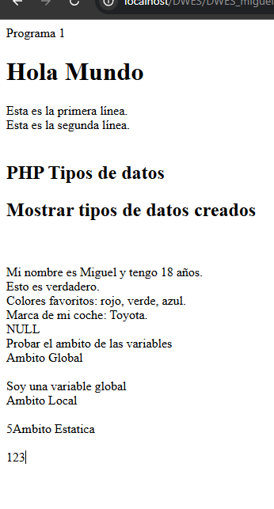

#### Ámbitos de las Variables

Podemos encontrar diferentes ámbitos:

- Global: Variables definidas fuera de cualquier función
- Local: Variables definidas dentro de una función
- Estático: Variables locales que persisten su valor entre llamadas a la función usando static

## Programa 2

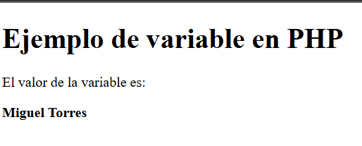

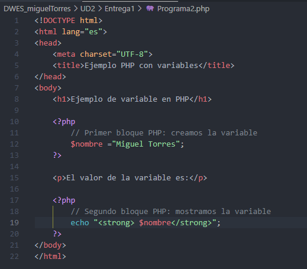

Como podemos ver en el Programa 2 abajo en el apartado de echo faltaba poner $nombre y arriba quedaba por asignarle un valor a la variable en este caso "Miguel Torres"

#### Diferentes ejemplos usando echo y print

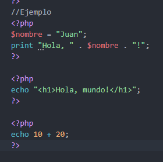

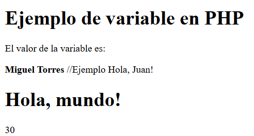

#### Printf y especificadores de tipo

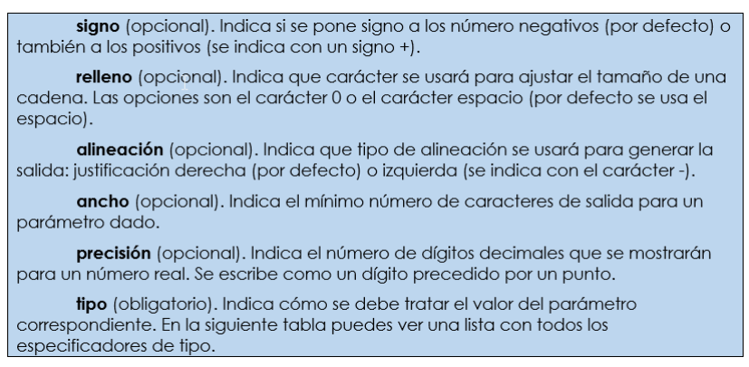

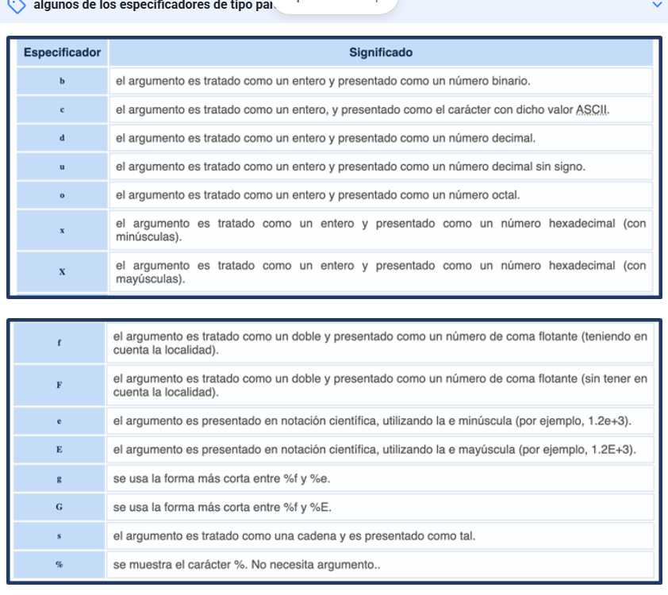

## Programa 3

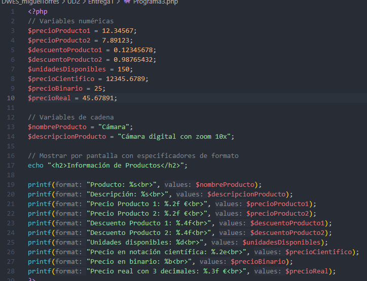

En este script PHP se crean varias variables relacionadas con productos de una empresa, tanto numéricas como de tipo cadena. Se utilizan los **especificadores de formato** de `printf` para mostrarlas por pantalla

Esto permite formatear los datos de forma clara y profesional para su presentación.

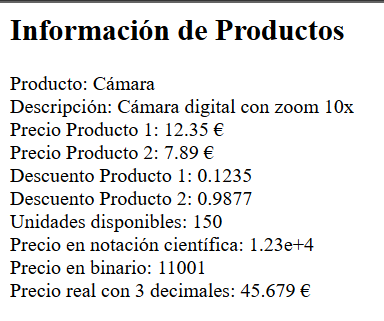

## Programa 4

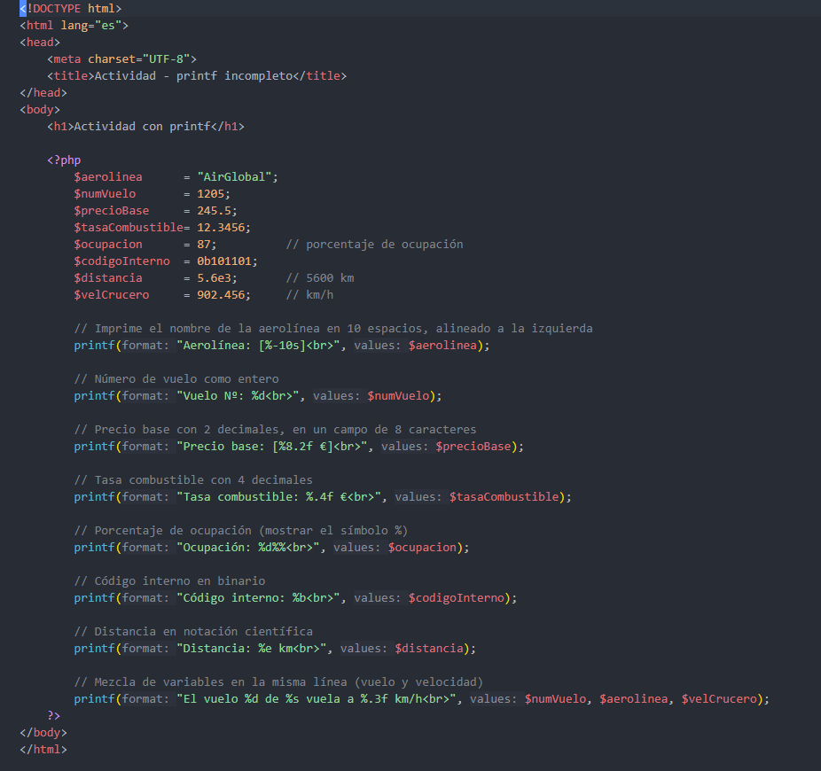

Como podemso ver en los printf ya hemos cambiado los signos de interrogación por su valor

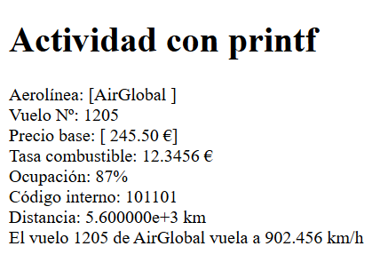

Esto es lo que mostraria la pagina una vez cambiado

Aqui podemos ver la diferencia de printf y sprintf

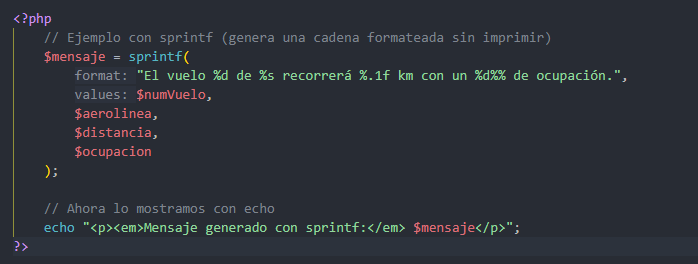

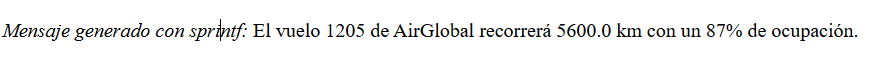

## Programa 5

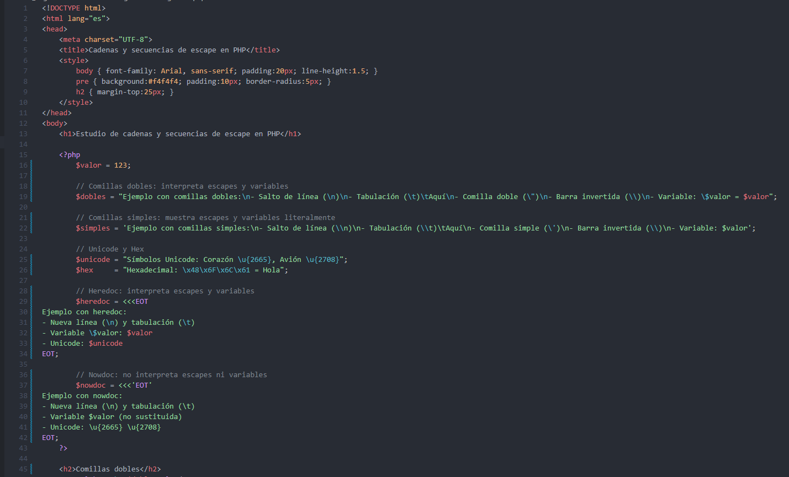

Unas de las cosas vistas en el programa 5 es la diferencia de la utilización de las comillas simples y dobles

## Programa 6

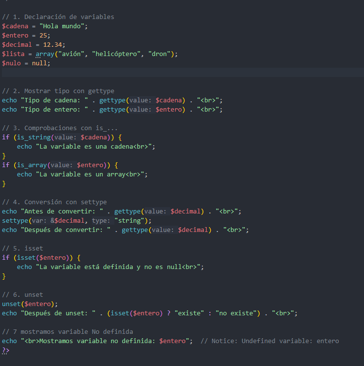

En el programa 6 hemos usado nuevos elementos como el unset y algunos mas

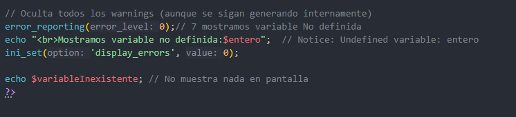

Añadimos estas lieneas de codigo para ocultar el warning

## Programa 7

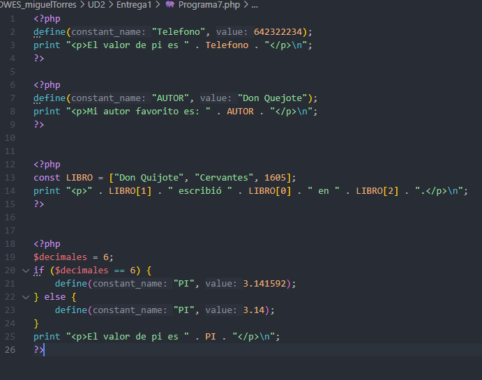

Aqui estamos viendo las constantes y viendo las diferentes formas de declararlas y como declararlas de forma correcta

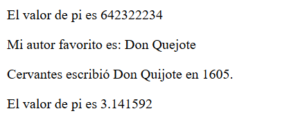

Este seria el resultado del codigo de arriba

## Programa 8

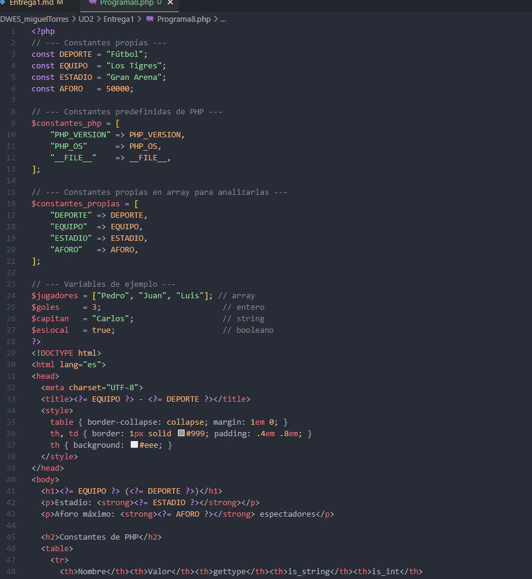

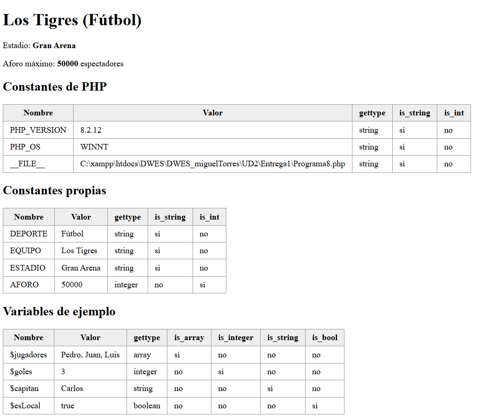

Como podemos ver podemos ver varias tablas con un titulo cada uno y unos valores variados viendo variables, cosntantes propias, predefinidas

## Programa 9

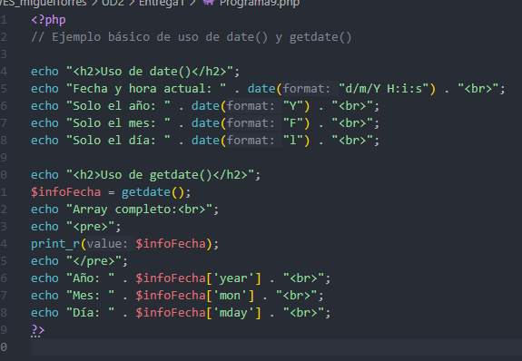

Como podemos ver Date permite obtener la fecha y hora actual en diferentes formatos mientras getdate devueve un array asociado con los datos de las fechas de cuando se añadieron los datos

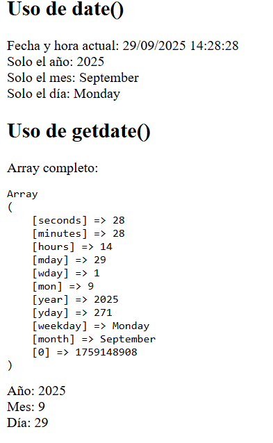

## Programa 10

En este programa tenemos que rellenar los huecos de codigo vacios

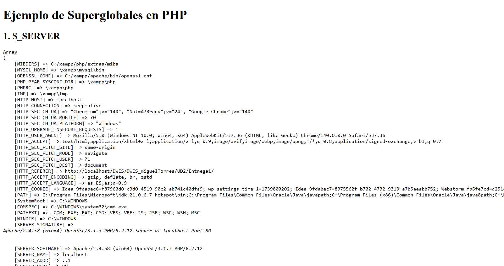

## Programa 10Sim

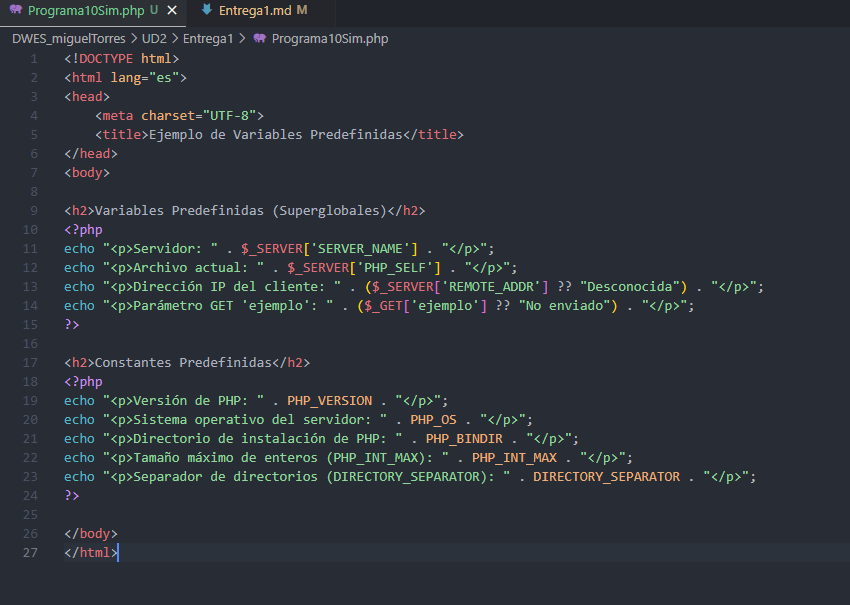

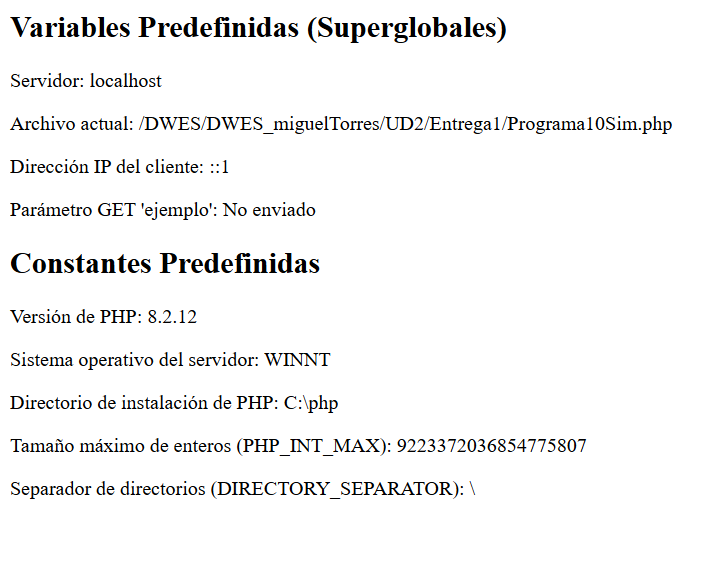
