# Entrega 2  (1/10/25)

En esta entrega veremos los siguientes puntos:

- Estructura de control
- Funciones
- Formularios

---

## Programa 11

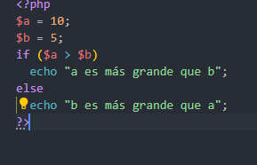

Aqui hemos declarado dos variables y hemos echo que las compruebe para ver cual es mas grande y este a sido el resultado

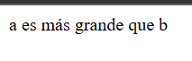

Tambien se puede hacer de esta forma que tendria el mismo resultado

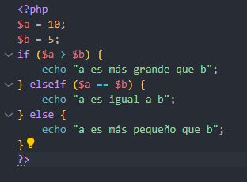

## Programa 12

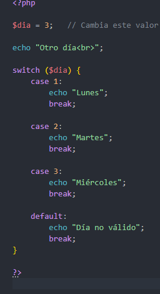

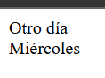

## Programa 13

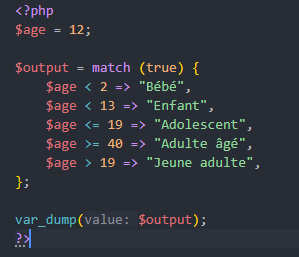

Como podemos ver a la edad le hemos declarado un valor y despues en el array ponemos que y la edad que le pasamos es menos o igual a los valores que tengo en el array corresponde con dada atributo del array

## Programa 14

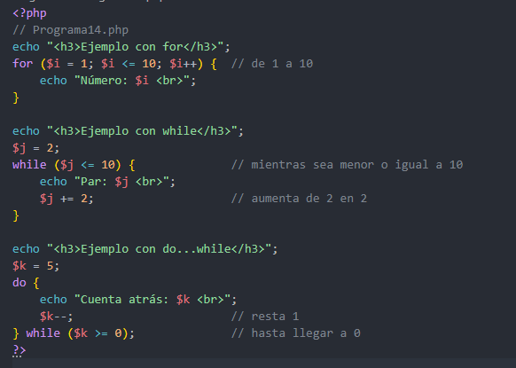

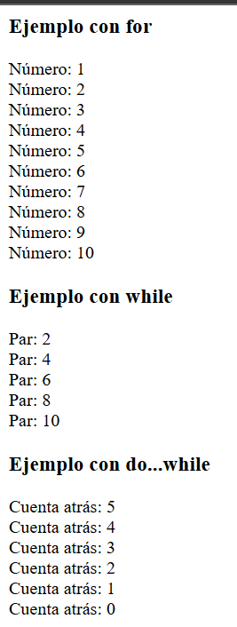

## Programa 15

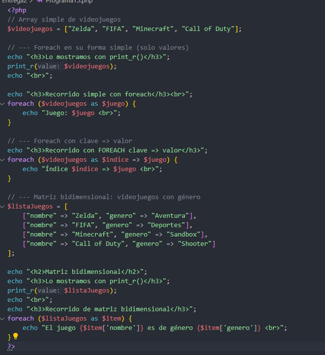

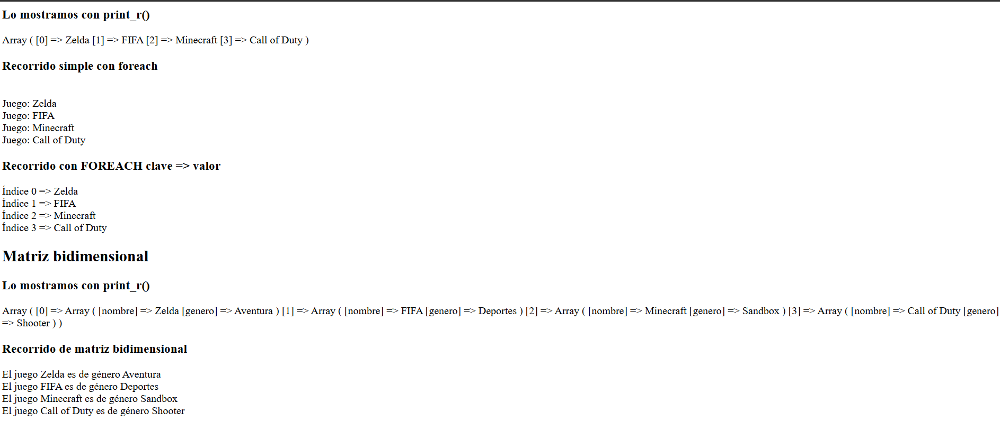

## Programa 20 - En grupo (Miguel Torres & Dani Castro)

En este programa hemos visto el uso de varias funciones nativas de PHP que facilitan tareas comunes como trabajar con cadenas de texto, fechas, números y arrays. Gracias a ellas podemos simplificar el código y hacerlo más legible y eficiente.

* `strlen()` → devuelve el número de caracteres de una cadena.
* `strtoupper()` → convierte un string a mayúsculas.
* `strtolower()` → convierte un string a minúsculas.
* `substr()` → obtiene una subcadena desde una posición.
* `date()` → devuelve la fecha y hora en el formato especificado.
* `number_format()` → da formato numérico con decimales y separadores.
* `rand()` → genera un número aleatorio.
* `array_sum()` → suma todos los valores numéricos de un array.
* `in_array()` → comprueba si un valor está en un array.
* `implode()` → convierte un array en una cadena.

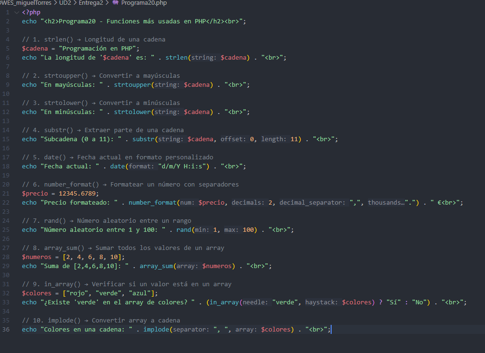

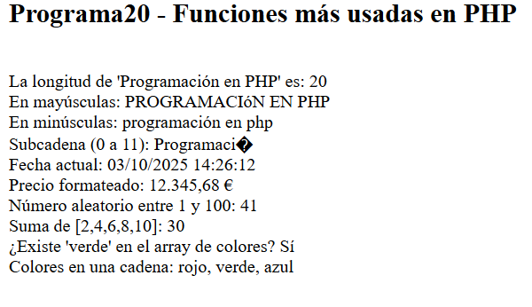
