# UD 3 PHP OO

Separar el código de presentación de la lógica de negocio en el desarrollo web

**Reflexión** "Los programadores experimentados ven en estas herramientas un apoyo que les permite concentrarse en las partes más complejas y creativas del desarrollo, mientras la IA se encarga de los detalles más tediosos. De esta manera, Copilot no reemplaza las habilidades del desarrollador, sino que las complementa."

[Articulo](https://codersfree.com/posts/programacion-orientada-a-objetos-en-php-definicion-ejemplos-y-principios-clave)

## Teoria

La Programación Orientada a Objetos permite organizar el código de manera modular, escalable y reutilizable.

El paradigma orientado a objetos se utilizo por primera vez conPHP 4 de forma basica hasta que despues salio PHP 5 siendo este mejor. Desde PHP 7 y 8, el lenguaje ha incorporado tipado estricto, traits, namespaces y mejoras en el rendimiento.

### Ventajas:

- Mantenibilidad
  - Permite realizar cambios en una capa sin que se modifique otra
- Reutilización de Código
  - Se puede reutilizar en diferentes interfaces
- Escalabilidad
  - Facilita la expansion de la aplicación
- Mejora en la Prueba y Depuración
  - La logica de negocio puede ser probada de forma aislada
- Facilita el Trabajo en Equipo
  - Permite que los desarrilladores trabajen en paralelo
- Flexibilidad en la Presentación
  - Permite que la capa de presentación se dapte a diferentes tecnologías
- Facilidad para Implementar APIs y Servicios Web
  - Con la logica de negonio desacoplada es facil exponerla a traves de una API
- Uso de Patrones de Diseño y Buenas Prácticas
  - Facilita la implementacion de modelo MVC

## Programa 1

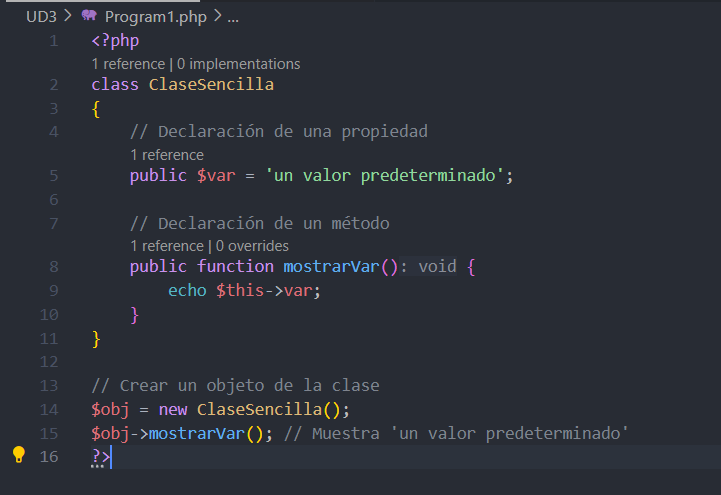

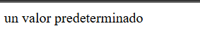

Como podemos ver creamos un objeto una propiedad y un metodo

## Programa 2

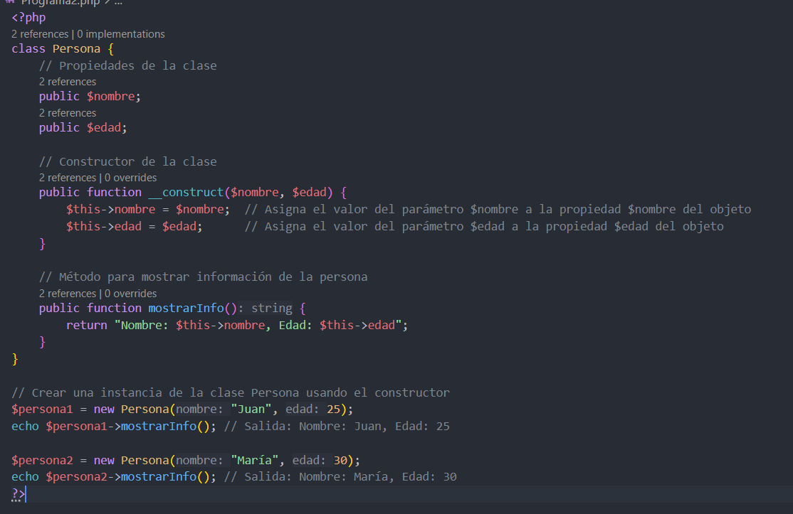

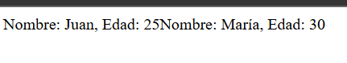

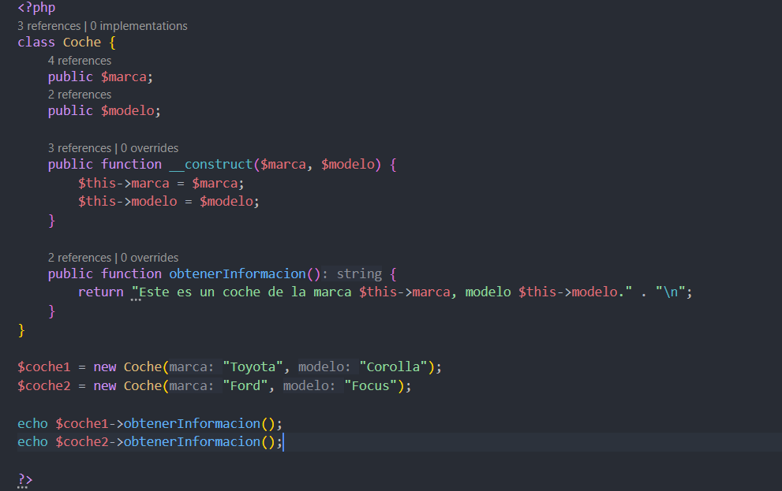

## Programa 3

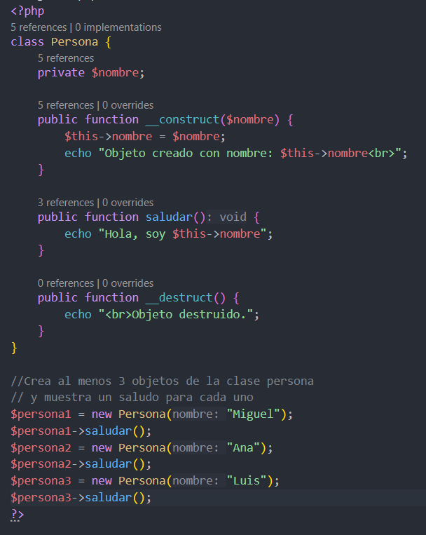

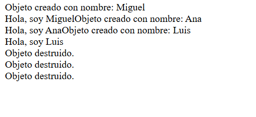

## Programa 4

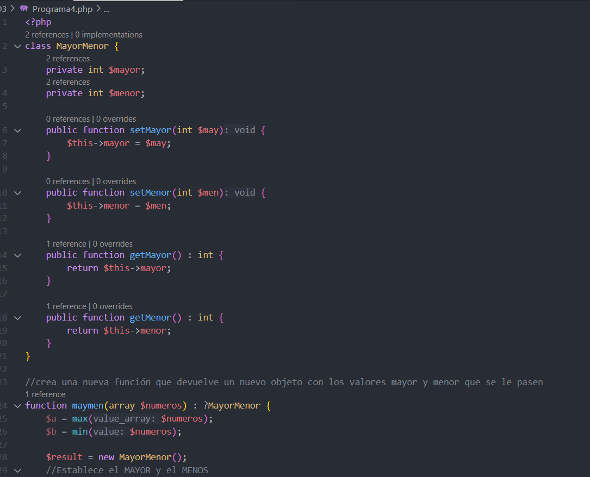

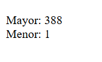

## Programa 5

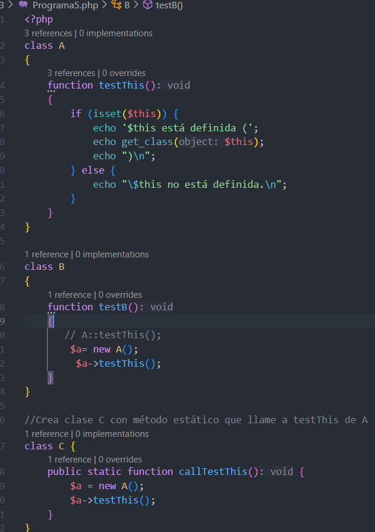

## Programa 6

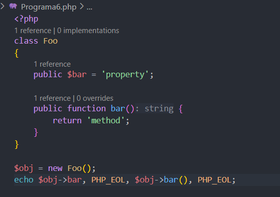

## Programa 7

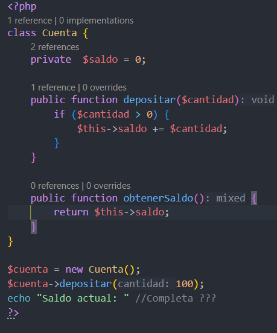

## Programa 8

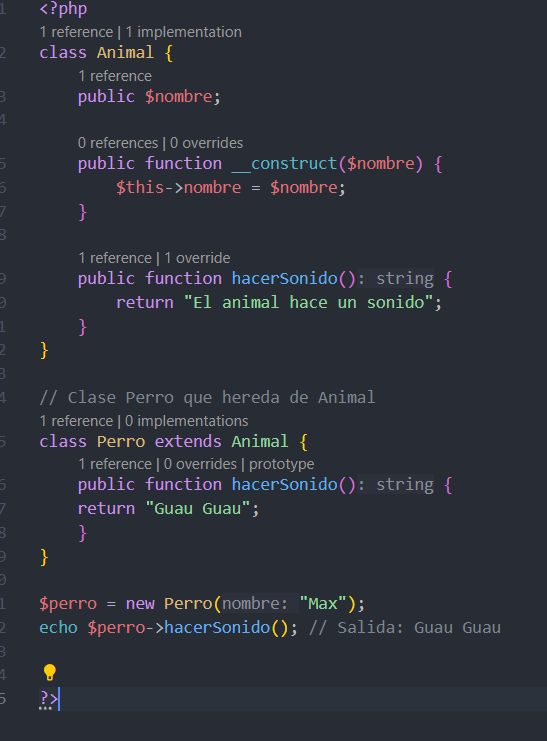

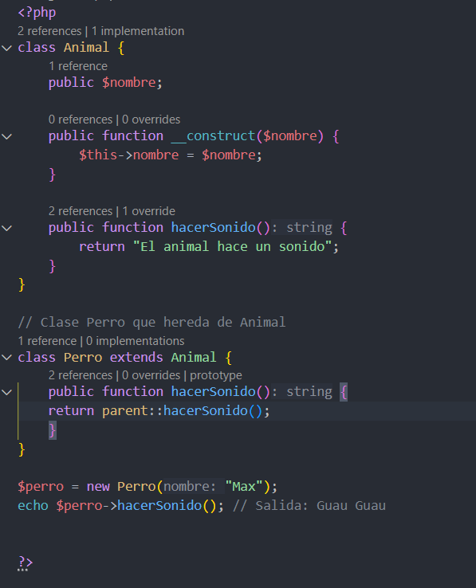

## Programa 9

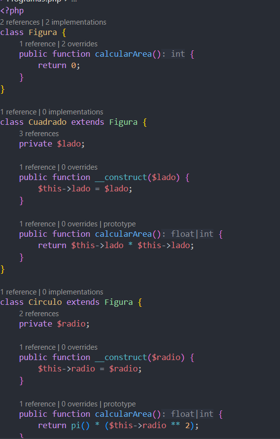

Este código demuestra el **Polimorfismo** y la **Herencia** en la POO de PHP, permitiendo que diferentes figuras (`Cuadrado` y `Círculo`) hereden y **sobrescriban** el método `calcularArea()` de la clase base `Figura` para ejecutar el cálculo específico de cada forma.

## Programa 10

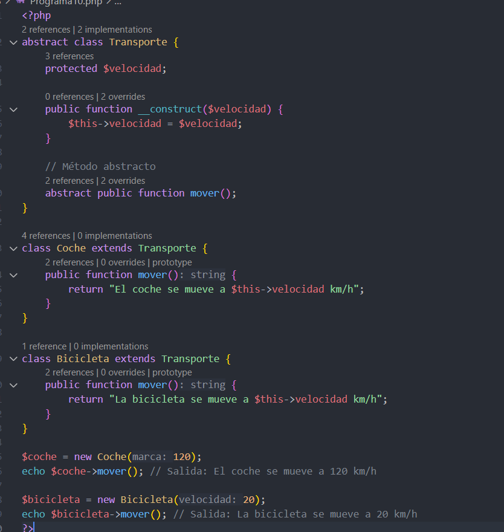

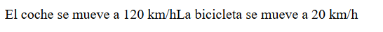

## Programa12

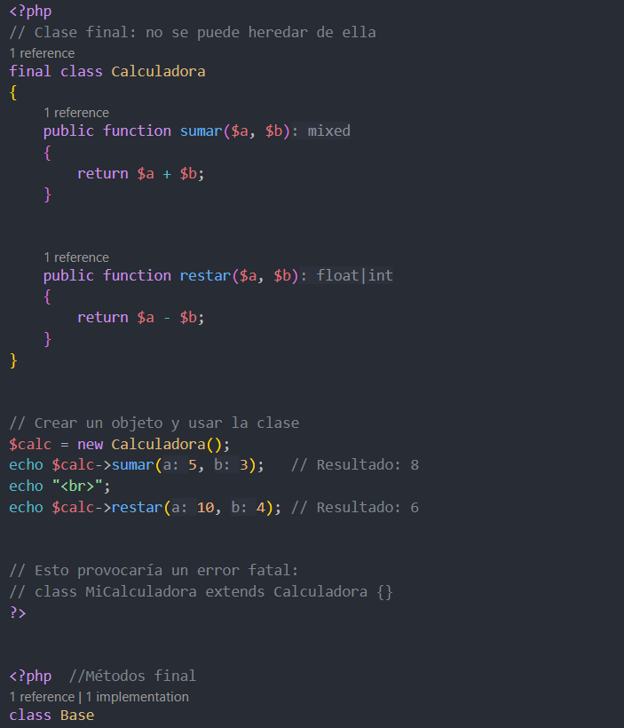

## Programa 13

En vez de crear una clase se utiliza el trait y para usarlo se usa el use

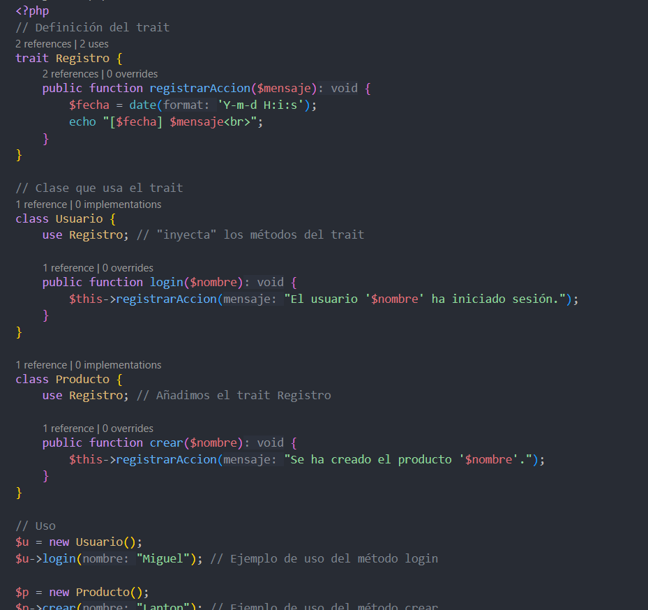

## Programa 14

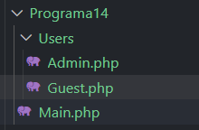

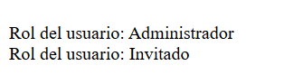

## SPL 

SPL es la Libreria estandar de PHP que es un conjunto de clases e interfazes integradas que porporcionan funcionalidades

## Programa 15

Se crea una Pila que esta doblemente enlazada y despues se le apaden valores

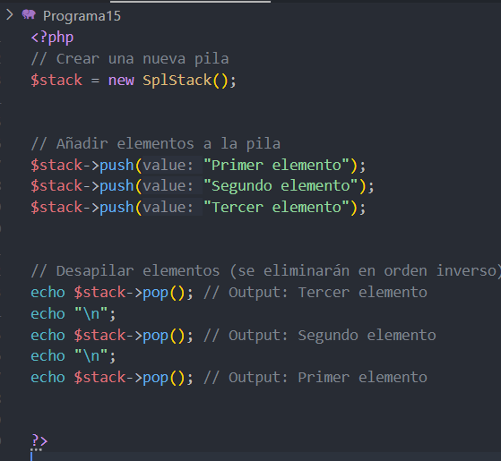

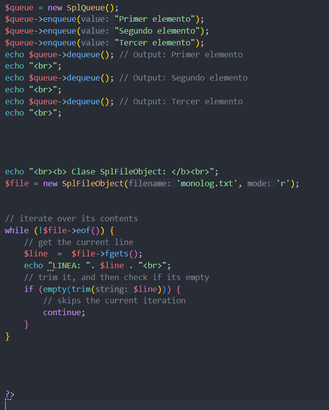

## Programa 16

Esto es un registro de carga automatico

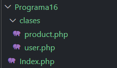

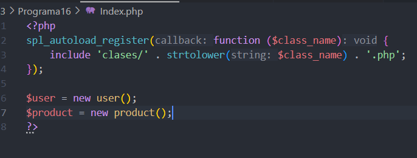

