# UD 4 Acceso a Datos

## 1. Un Poco de Historia

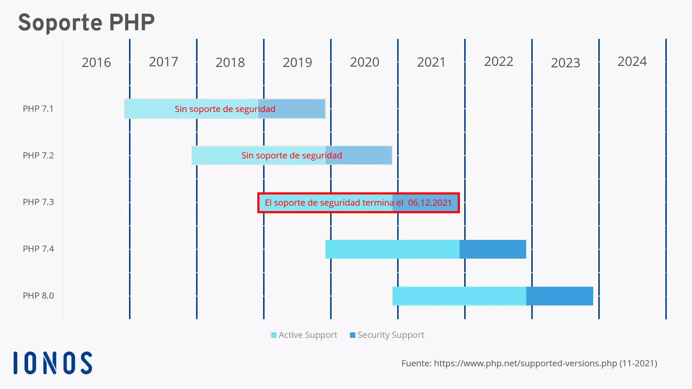

[Enalace1](https://www.php.net/manual/es/history.php.php)

[Enlace2](https://drupalsapiens.com/es/blog/php/historial-y-cronologia-de-versiones-php)

PHP inicialmente fue conocido como "Pagina de inicio personal" y fue escrito en lenguaje C como un conjunto de herramientas de script PERL/CGI

## 2. Preparando el Entorno

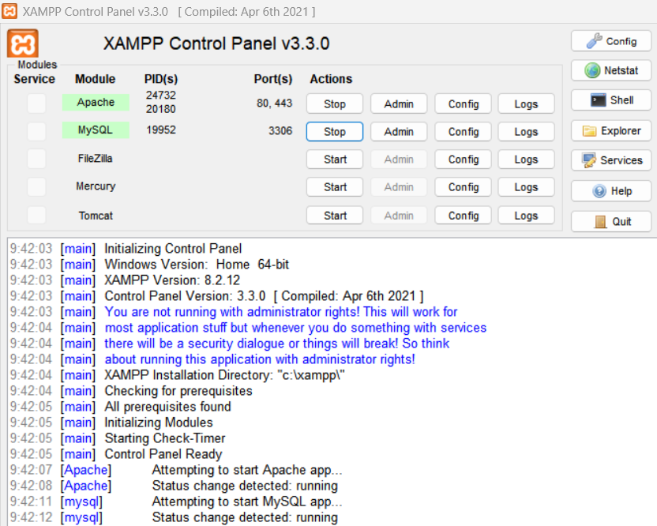

Como podemos ver en el XAMPP arrancamos el Apache y MySQL

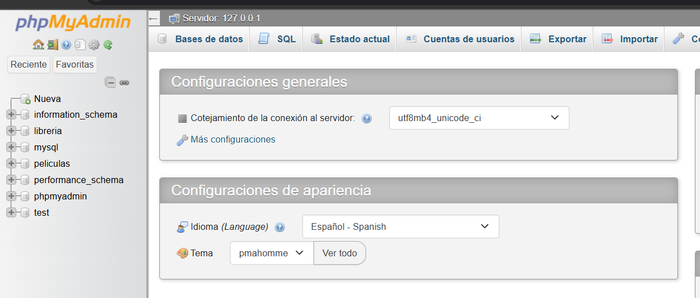

Y en el apartado de MySQL le damos a admin y se nos habre en el navegador

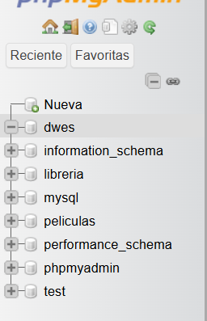

Hemos creado una base de datos para la asignatura llamada "dwes"

Yo he creado esta estructura de carpetas

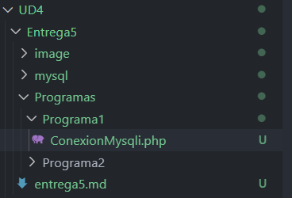

## Programa1

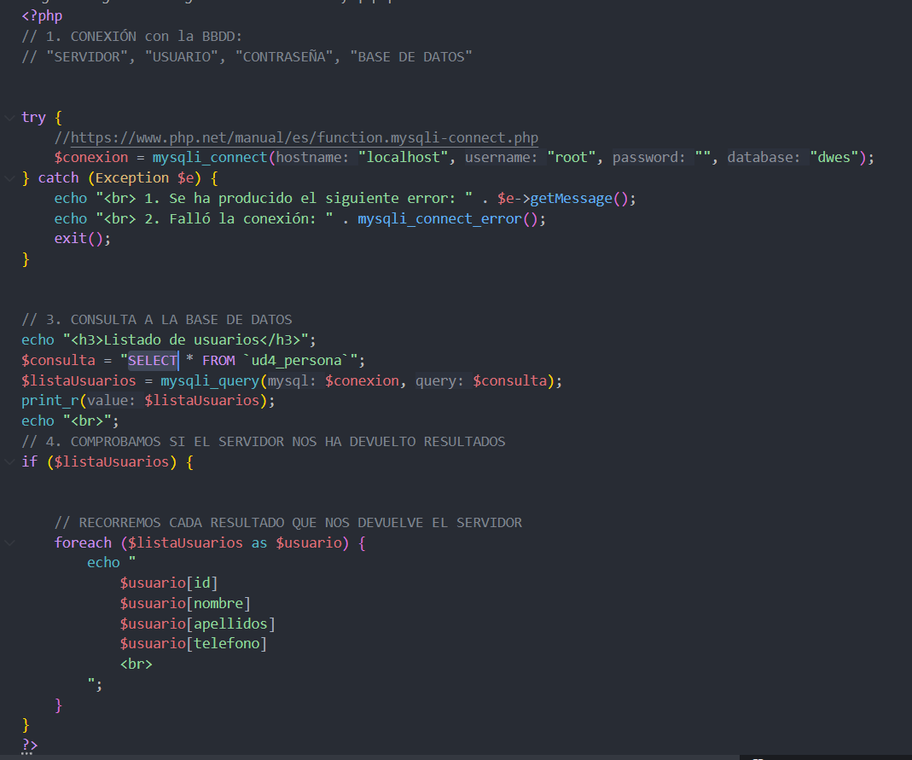

Como podemos ver en el codigo creamos una variable con una consulta SQL esto motraria lo que vemos en la imagen de abajo

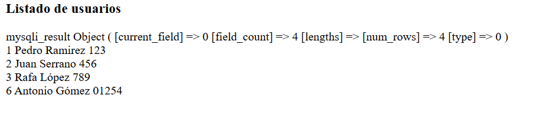

## Programa2

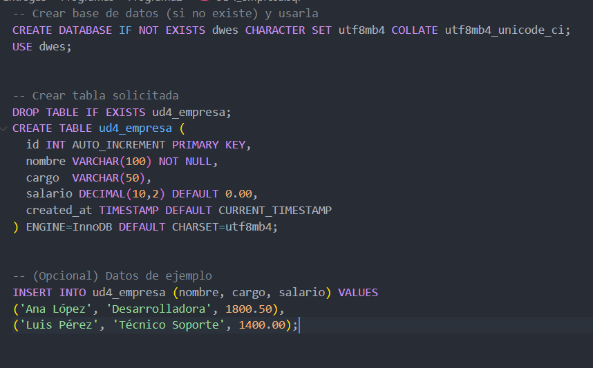

Con esta consulta sql he creado la tabla que vemos abajo

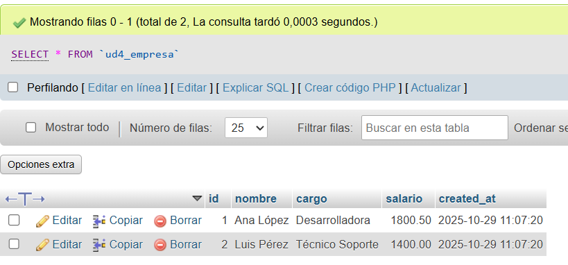

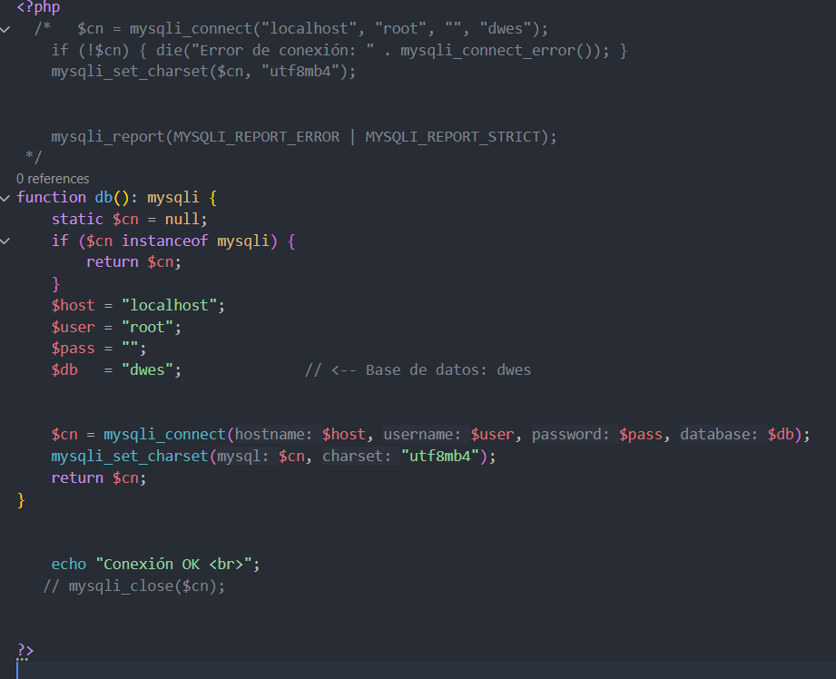

Tenemos un codigo php que nos devuelve lo que vemos abajo si se a conectado exitosamente

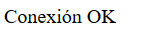

## Programa2/2

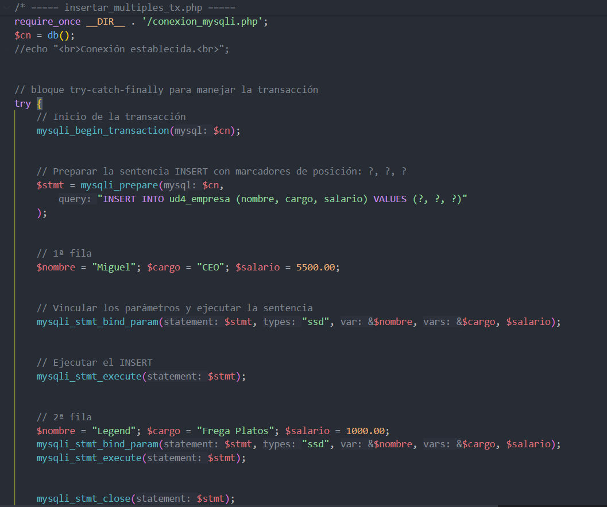

El codigo nos inserta en la base de datos las personas en la BD

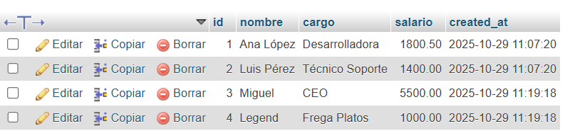

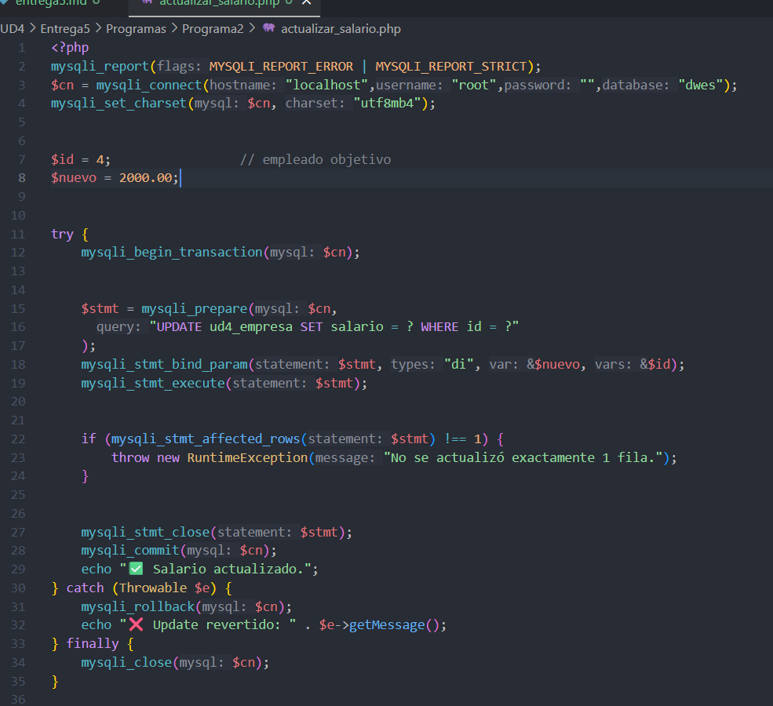

Con este codigo hemos modificado el salario de un usuario ya añadido seleccionando el id y el salario en la lina 7 y 8

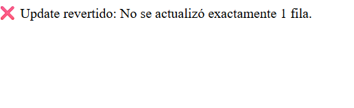

en la lina 7 hemos puesto un ID que no existe y saltaria el error

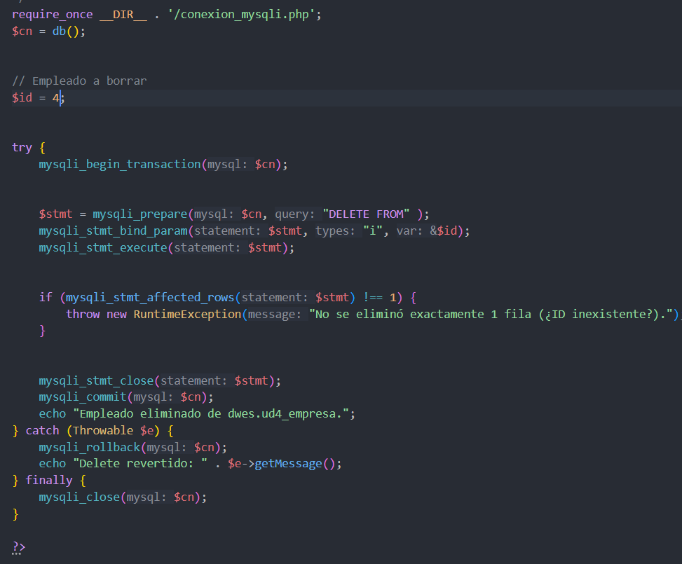

El codigo que acabo de mostrar tenemos que elgir el ID de un usuario paea eliminarlo

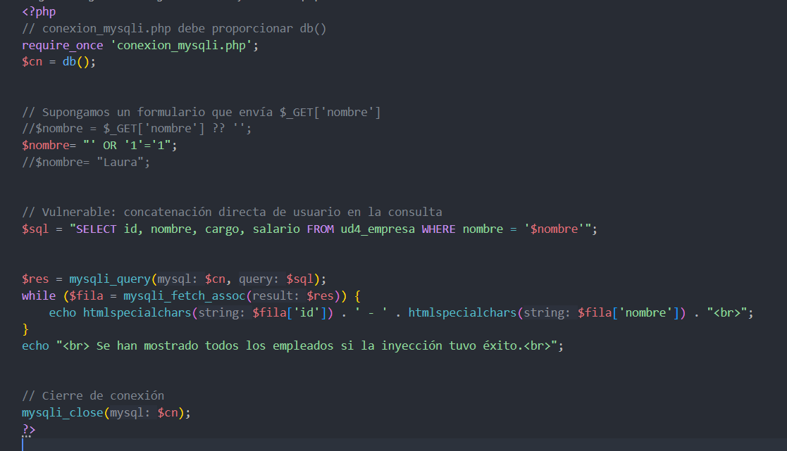

Este codigo es el ejemplo de una mala practica para insertar datos a la base de datos

## PDO(PHP Data Objects)

## Programa3

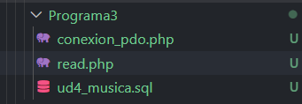

Esta es la estructura de archivos

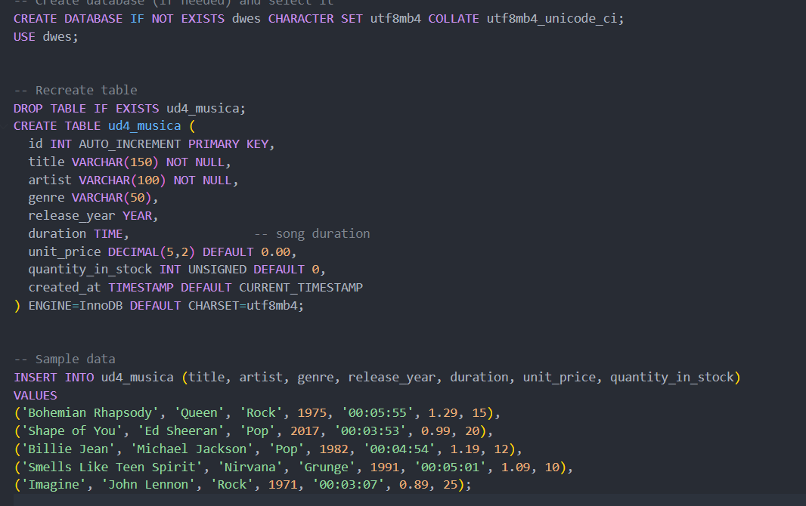

Esta es la consulta para crear la tabla

Este es el archivo php de la conexion

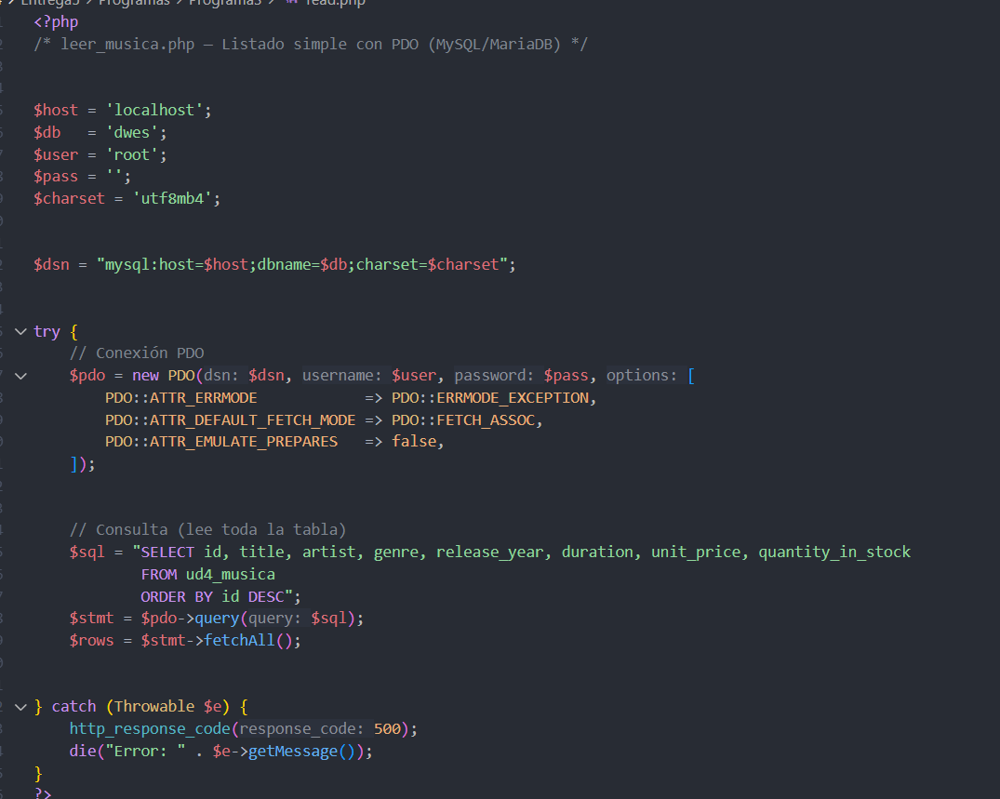

Y este es el archivo que hace las consultas y las muestra
