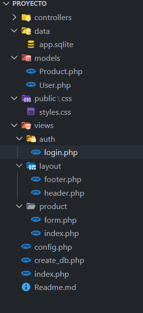
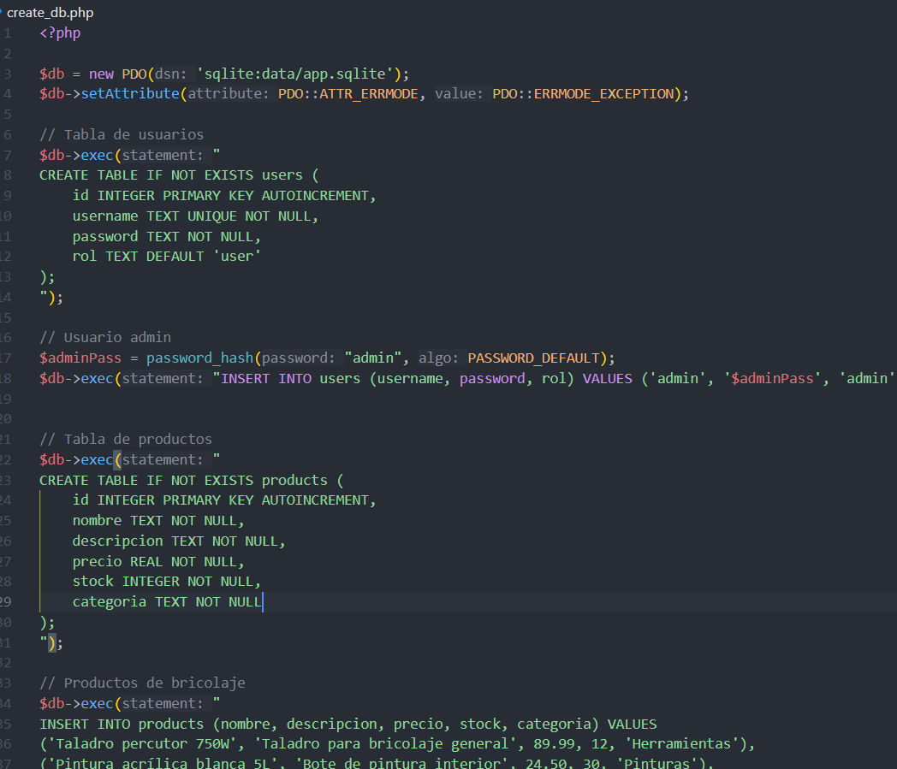
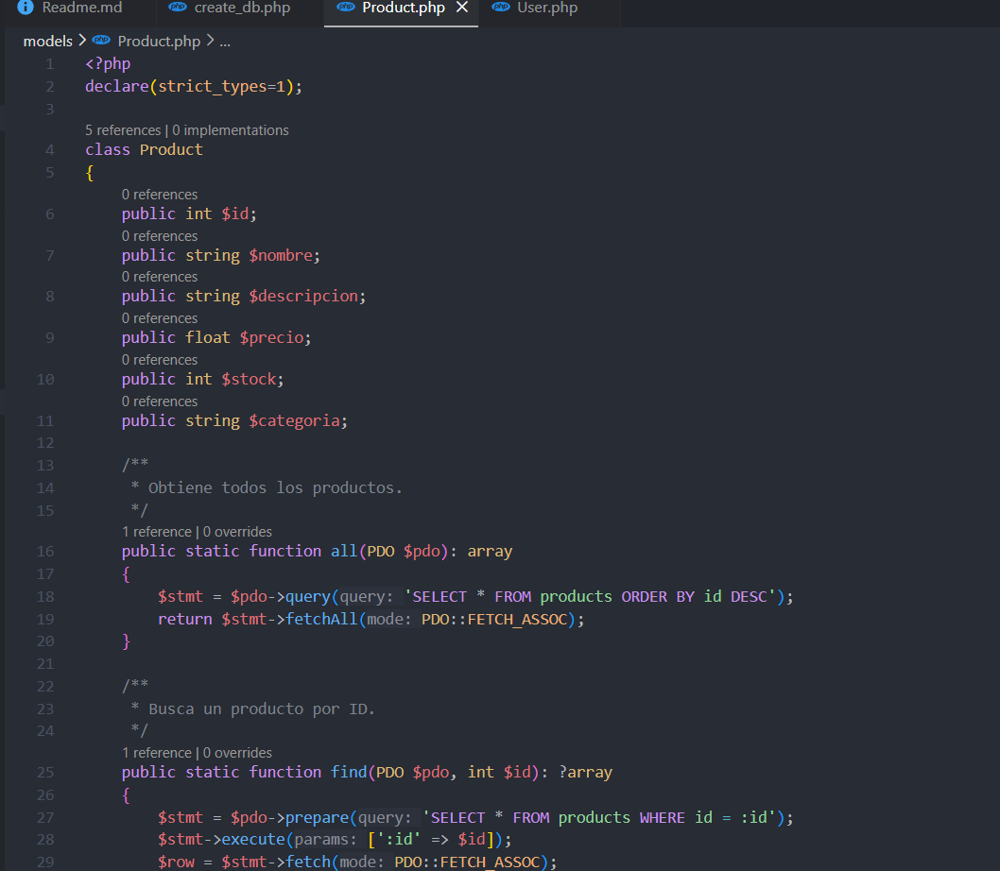
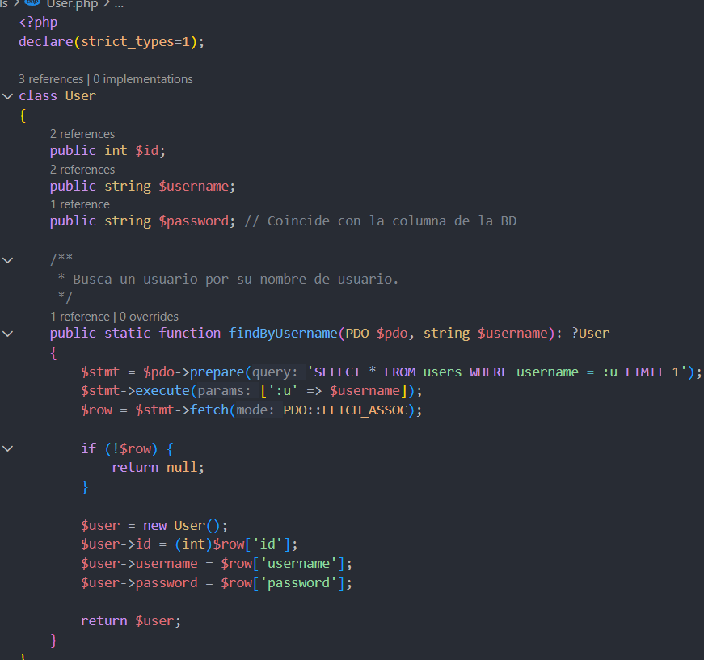

# Proyecto

Esta es la estructura que he seguido como guion con una de las actividades echas en clase

Primero he empezado cambiando el archivo para la creacion de la base de datos con los productos que necesito

Despues en Productos he puesto todos los atributos y las funciones de mostrar, eliminar, editar

Y para los usuarios una funcion para ver si existen

## Version 2

Cambiar el css y corregir errores
