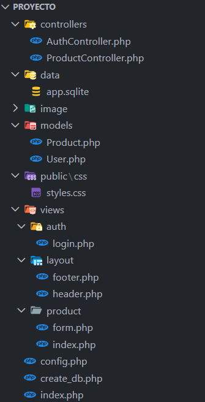
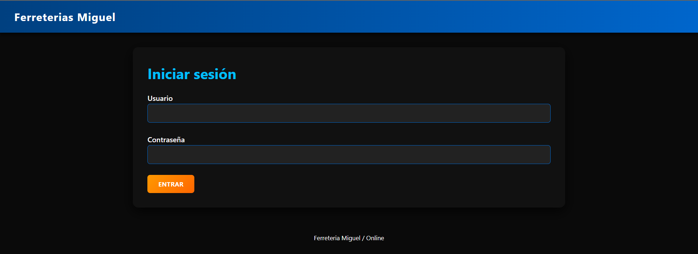
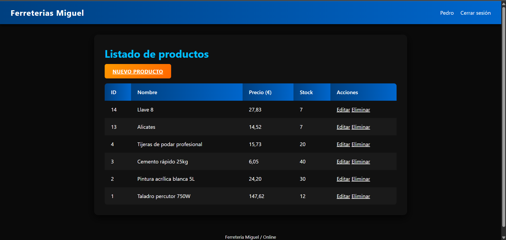
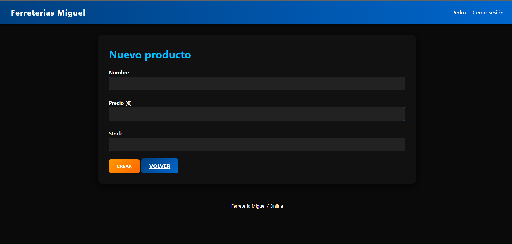
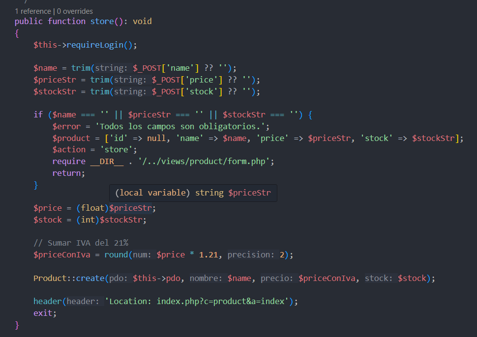

# Proyecto

Lo primero es mostrar como tengo organizado mi poryecto y mi orden de carpetas y archivos

Estas son las tres ventanas que veriamos en nuestro proyecto.

En el tenemos 3 usuarios:

- Admin "Admin"
- Pedro "1234"
- Luis "1234"

Todos van a poder ver el listado de productos, añadir nuevos productos, modificar productos y eliminarlos.

De cookies hemos añadido que la sesion se mantenga iniciada durante 1hora unque se cierre el navegador, eso como podemos ver en la imagen de abajo esta en el archivo AuthController.php en la funcion doLogin tenemos abajo la setCookie

Despues hemos añadido para cuando añadamos un nuevo producto que se nos añade el IVA  y nos lo muestre con el IVA ya añadido

