    UNIDAD 5
    Elace Video
    https://drive.google.com/file/d/1a-EMjvuOp8stZ9kUHWLD2L-7eYZFfK9L/view?usp=sharing

## Cabezera del Servidor

[CloudFlare](https://www.cloudflare.com/es-es/learning/ddos/glossary/hypertext-transfer-protocol-http/)

Tipos de errores al solicitar una pagina

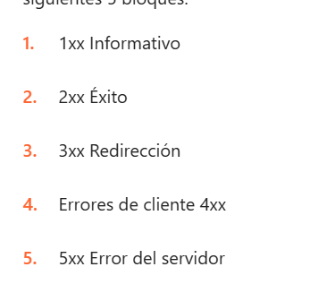

## Programas

### 1

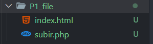

Esta es la estruccura de este programa

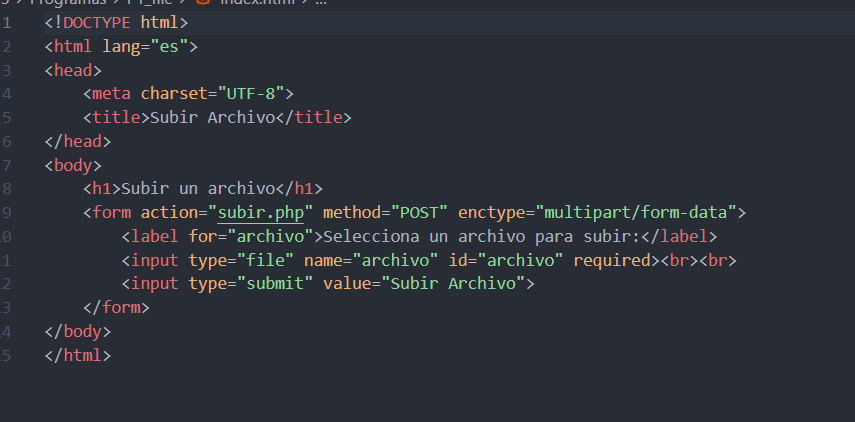

En el que podemos seleccionar un archivo y subirlo

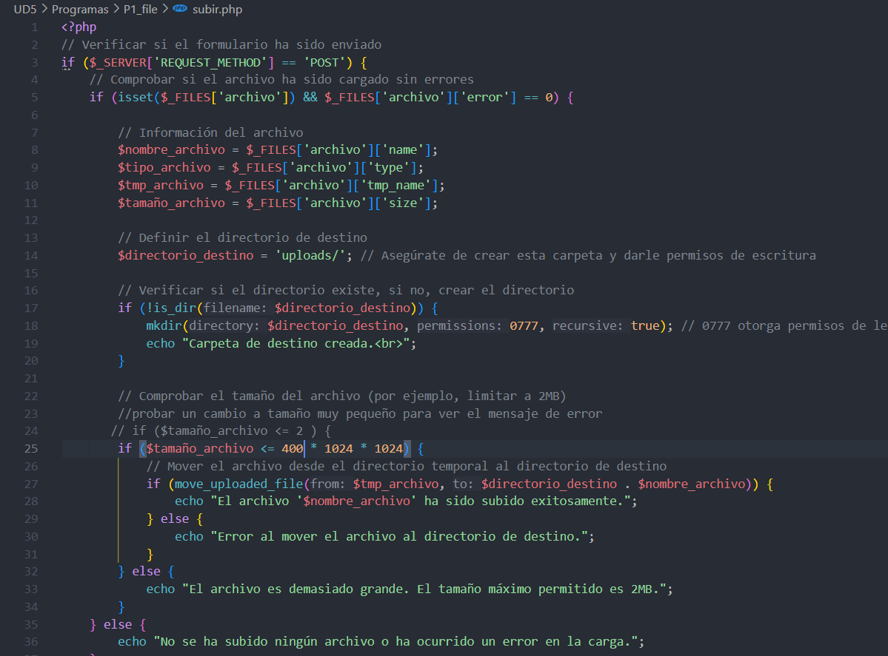

Y el el PHP podemos limitar el peso del archivo

### 2

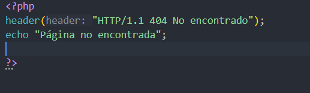

Este codigo no escuetra la pagina y sale el error 404

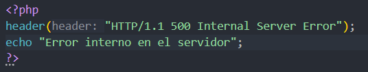

Hemos cambiado el codigo para que nos salte el error

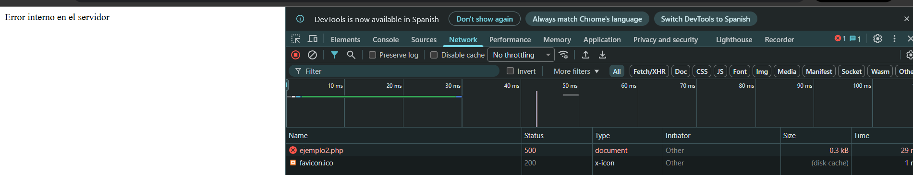

### 3

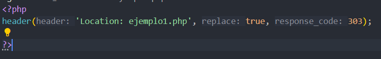

Lo que esta haciendo este programa es rederigirnos a lo que tenemos escrito en el programa 1

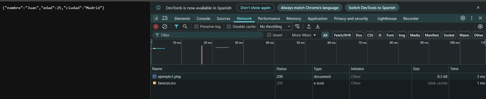

### 4

### 5

Este programa es para que se guraden las cookies

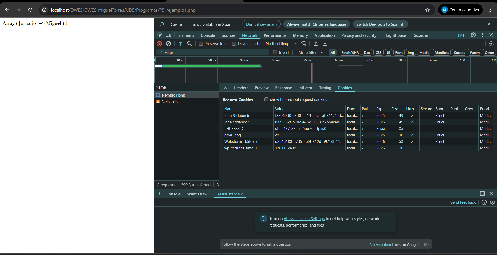

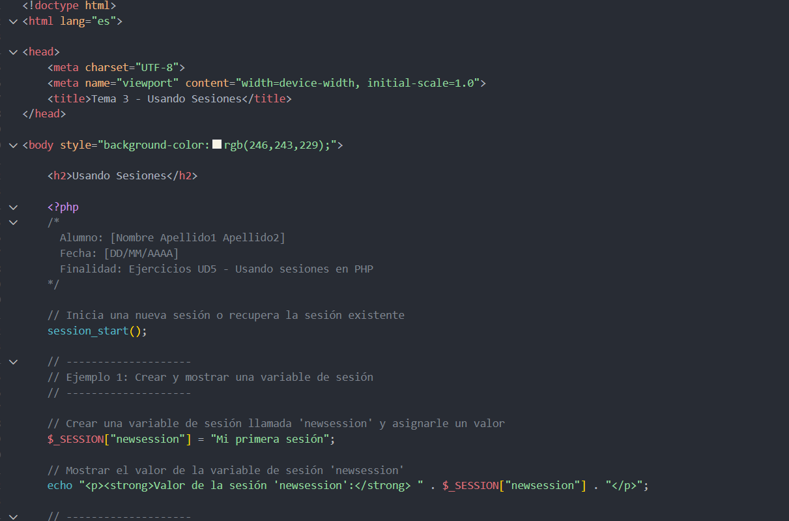

Despues este otro codigo sirver para mostrar la ultima sesion

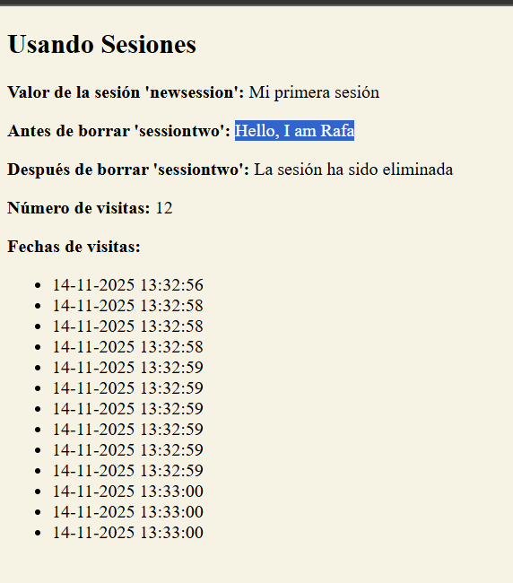

### 6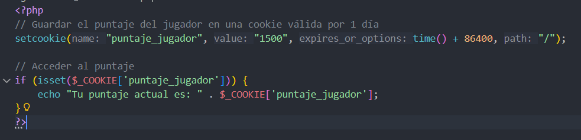

Como  podemos ver lo que te muestra en la pantalla se gurada como cookies

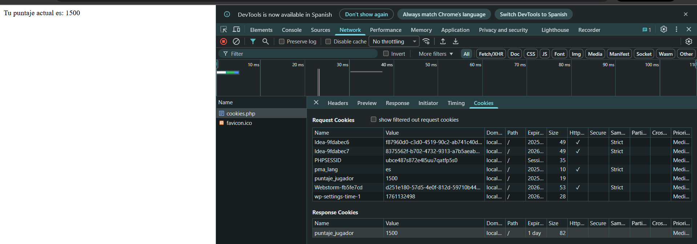

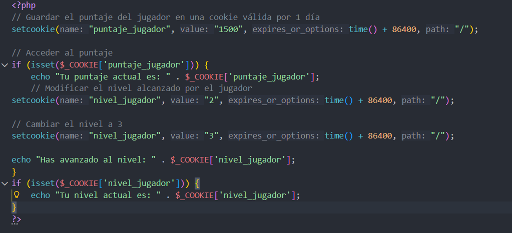

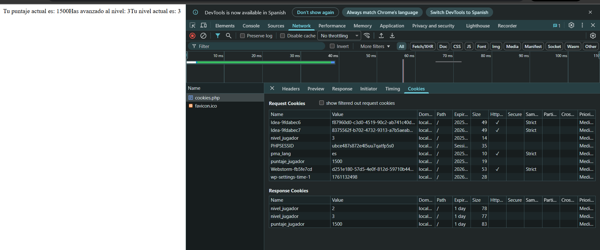

### 7

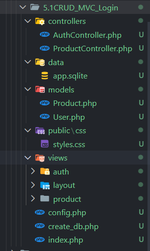

Esta es la estructura de la ultima actividad echa en clase donde tocamos el login el logout y hemos visto paso a paso como se inicia sesion y los pasos que da.

## Punto 2 Sesiones

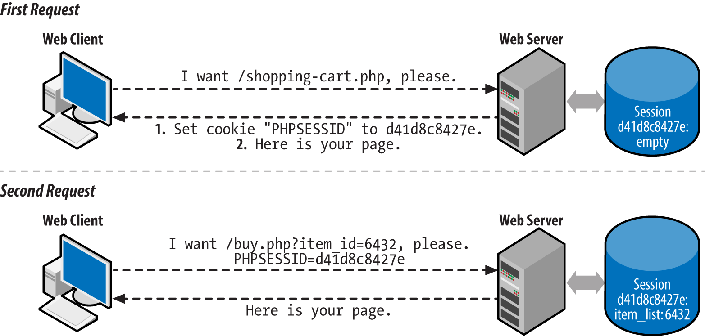

Cuando inicias sesion con session_start php envia una cookio al navegador con un ID unico
