Primero tenemos que crear la carpeta del poryecto

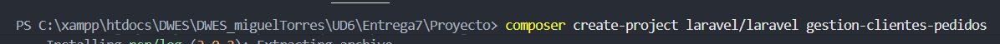

Creamos las migraciones de Client y Order

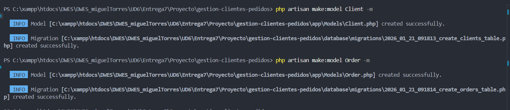

Ahora nos vamos a la migracion de create_cliente_table e insertamos los atributos/valores

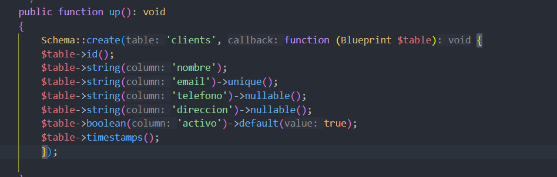

Y ahora modificamos la migracion de create_orders_table e insertamos los atributos/valores

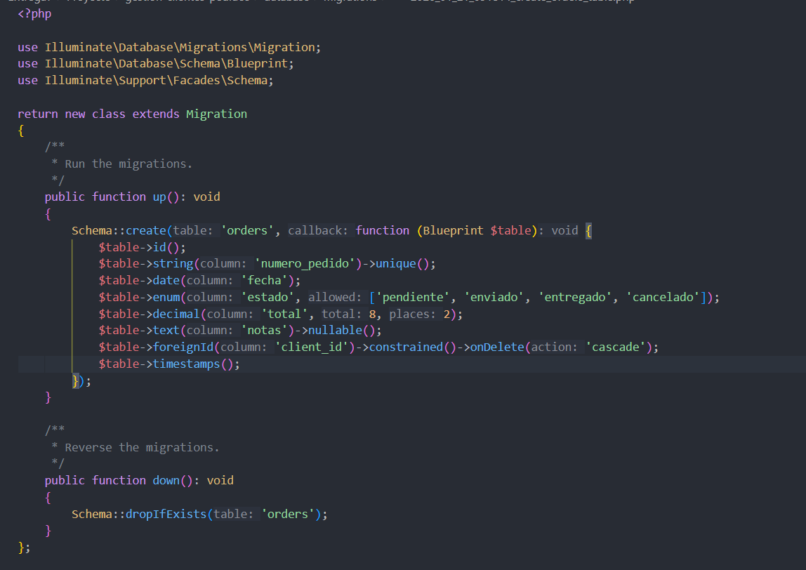

Como podemos ver la base de datos se ha creado correctamente

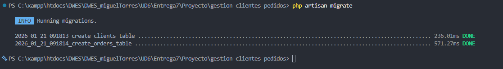

Ahora nos vamo al App/model y modificamos los archivos

Añadimos $fillable para permitir guardar datos y la relación orders 

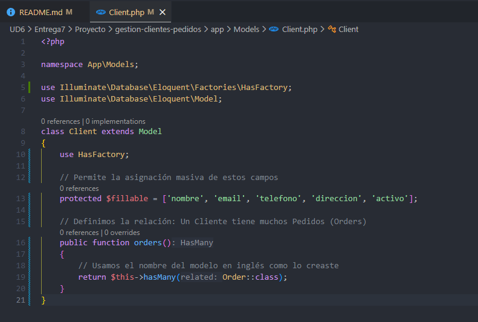

Hacemos los mismo con Order.php

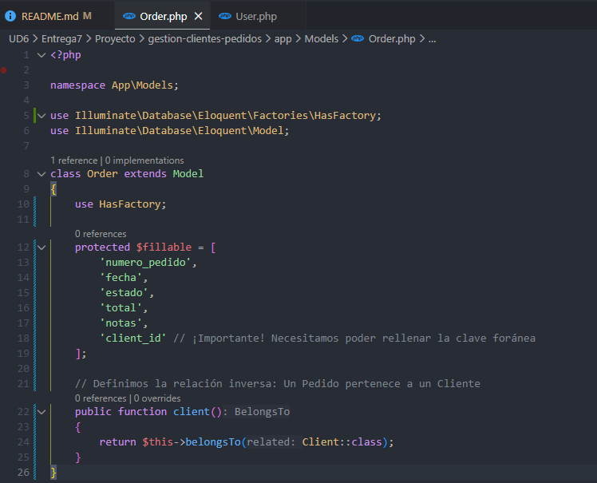

Ahora en database/factories/ClientFactory.php

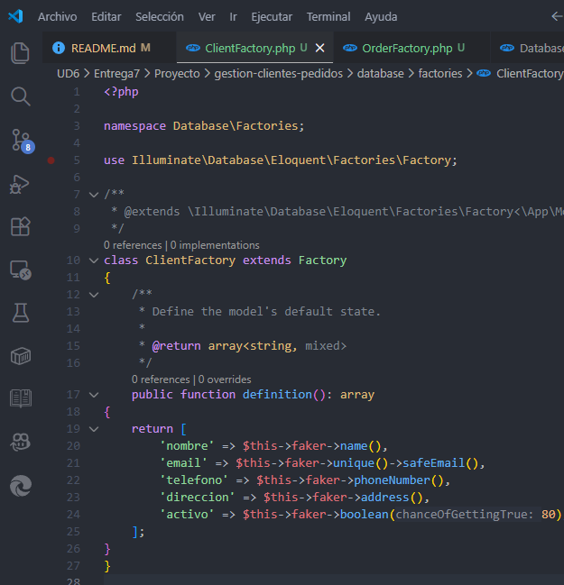

Y ahora en la misma carpeta pero el archivo OrderFactory.php

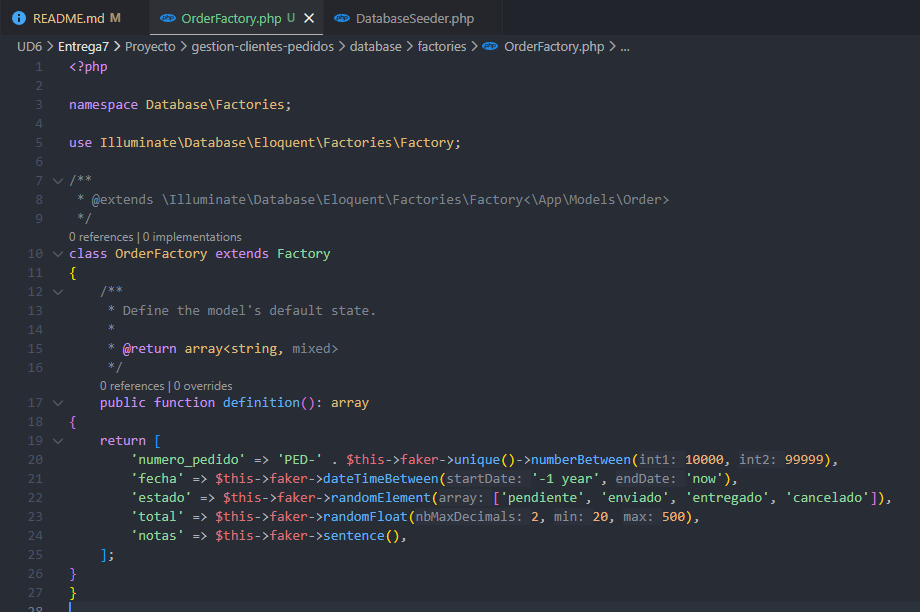

Ahora en DatabaseSeeder hacemos que nos cree 10 usuarios y nos añadan 3 pedidos por usuario

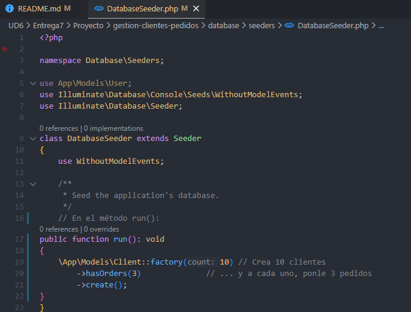

Ahora ejecutamos este comando en la terminal para reiniciar la base de datos y ejecutar los seeder

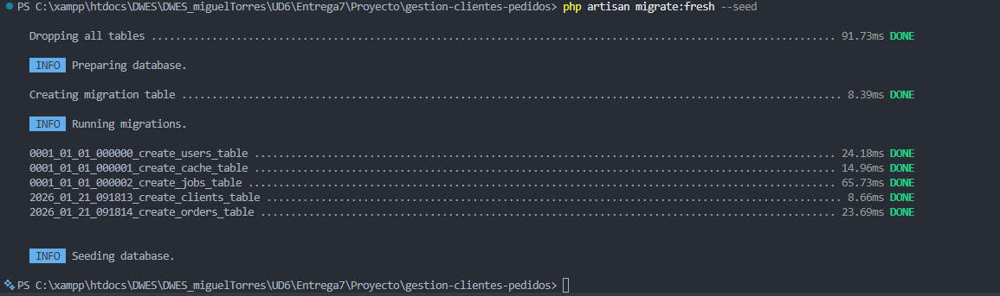

Ahora creamos los Controller de Client y de Order

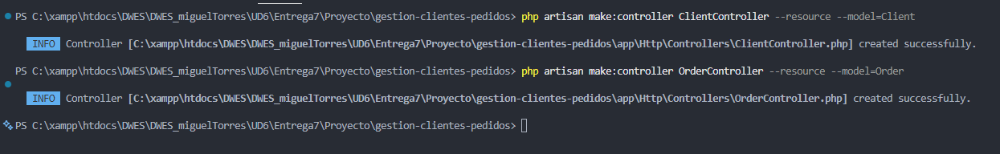

A continuacion nos vamos al archivo de web.php dentro de la carpeta de route y añadimos las routas de los controller

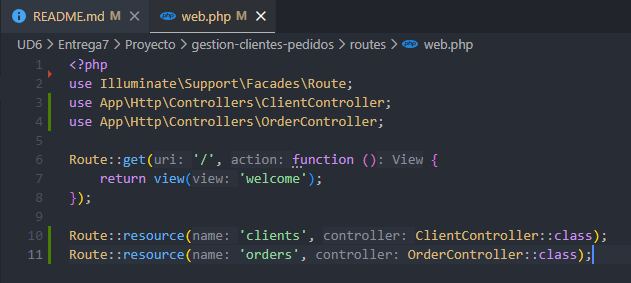

Ahora si nos vamos al ClientContreller.php y añadimos lo que vemos en la funcion Index para que nos muestre todos los usuarios

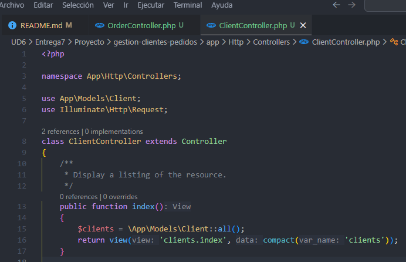

Ahora nos vamos a resources/views y creamos la carpeta clients y dentro el index

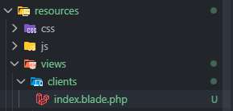

Ahora desde la terminal arrancamos lal pagina

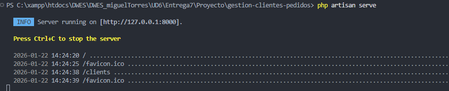

Y ahora en la URL añadimos "/clients"

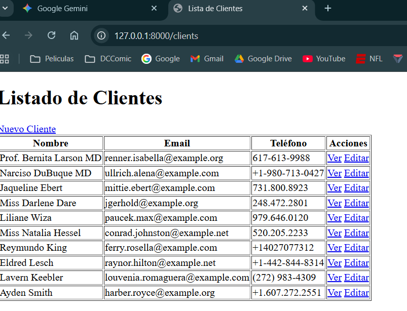

Ahora nos volvemos al archivo anterior y le damos funcionalidad a la funcion "show"

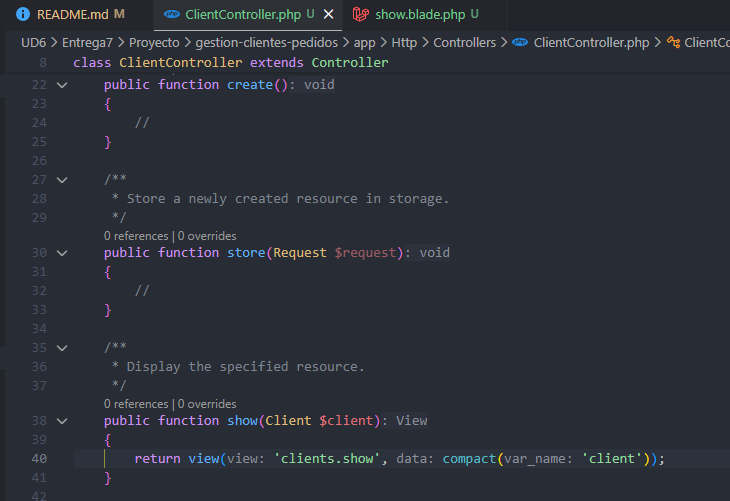

Y tambien creamos su show.blade.php

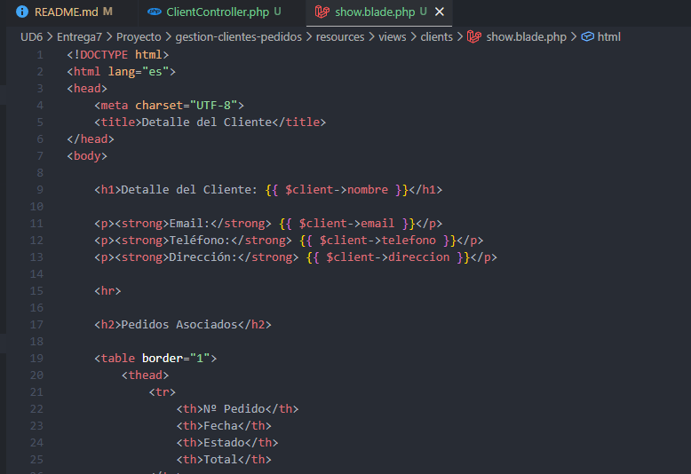
