# Laravel

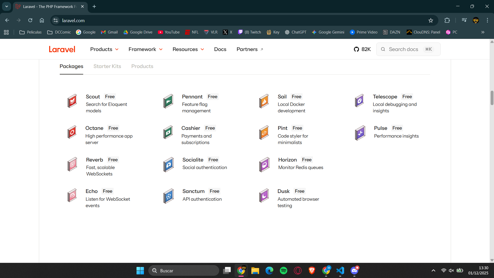

**[Video](youtube.com/watch?v=S5-ZQnjkFso&feature=youtu.be)**

Lo primero que hacemos es entrar en la pagina web de LARAVEL

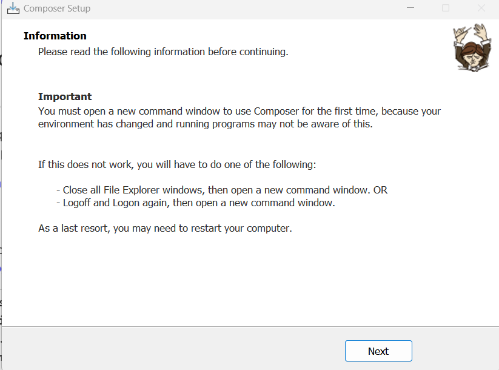

Ahora nos descargamos Composer

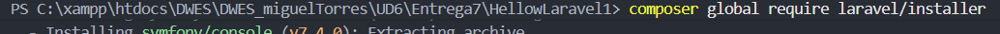

Tambien tenemos que descargarnos el global

Despues de ejecutar el comando se nos creara una carpeta con esta estructura

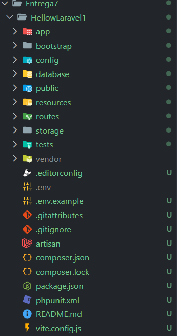

Fundamentos sobre MVC ([Video](https://www.youtube.com/watch?v=kV2jUg-iXYw&list=PLDllzmccetSM50U0Y9fTOWHvSzAZ_W6Il&index=2))

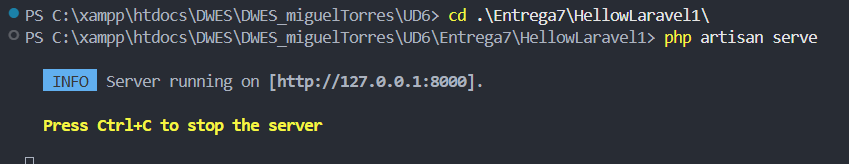

Como podemos ver ya estamos en el navegador

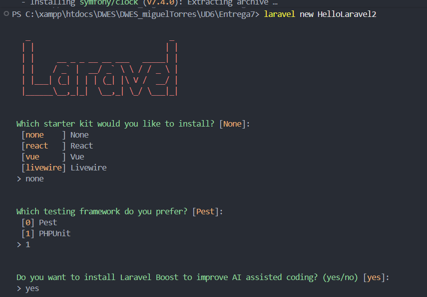

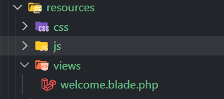

Como podemos ver los archivos que hay en vista acaban en ".blade.php"

Despues dentro de app encontramos http y dentro los controller y despues models que encontramos user

## CRUD Laravel Basico

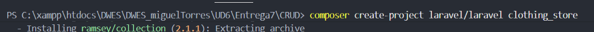

Primero nos descargamos la estructuras de carpetas de laravel

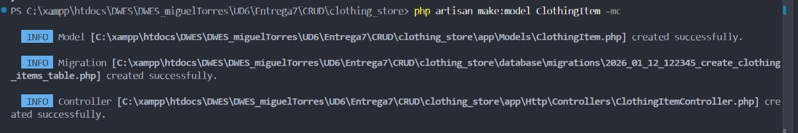

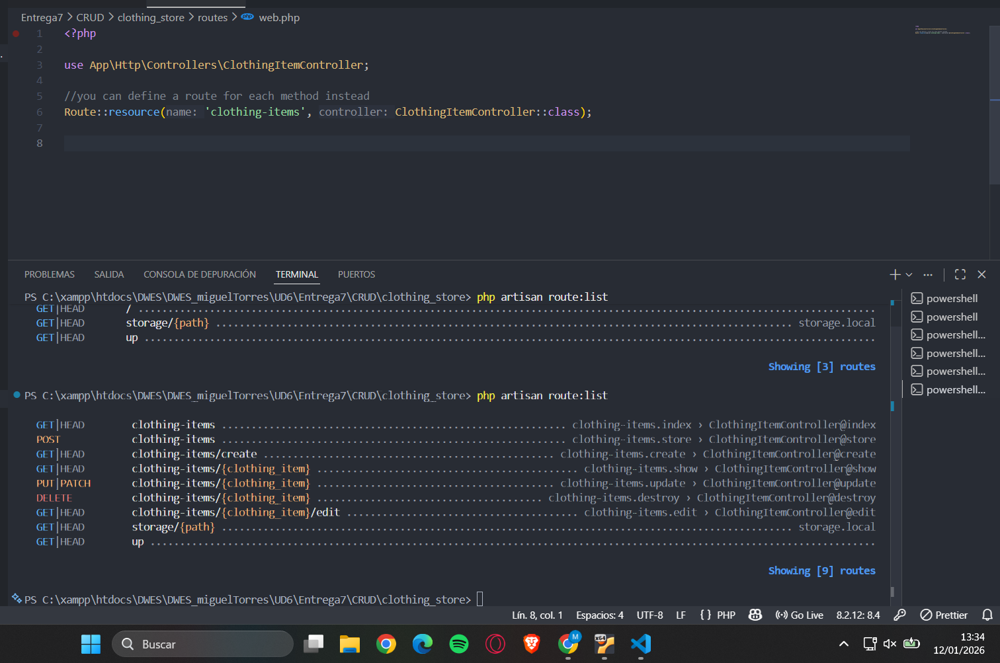

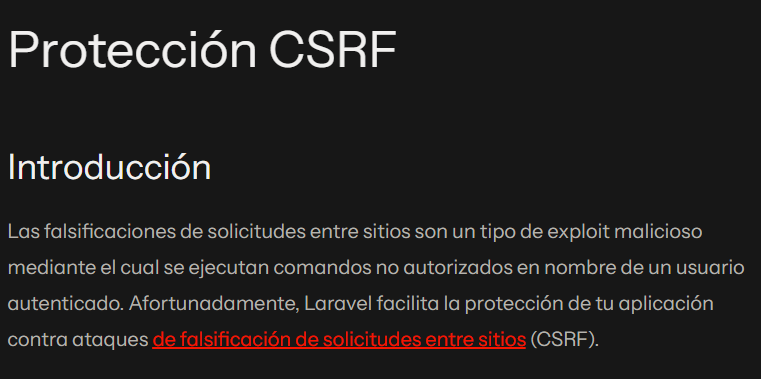
