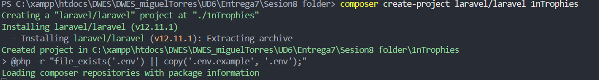
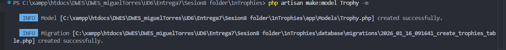
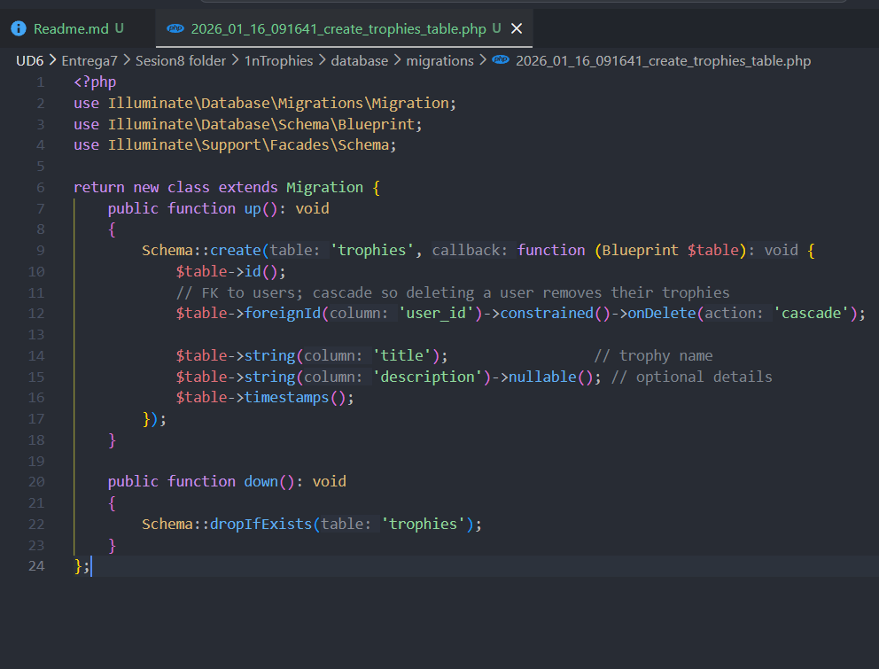
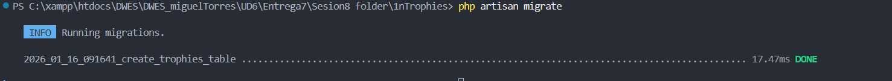
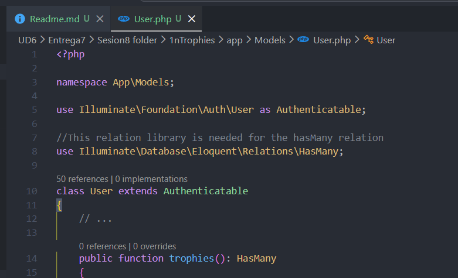
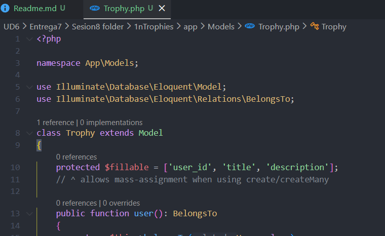
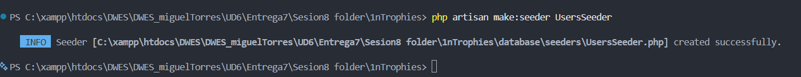
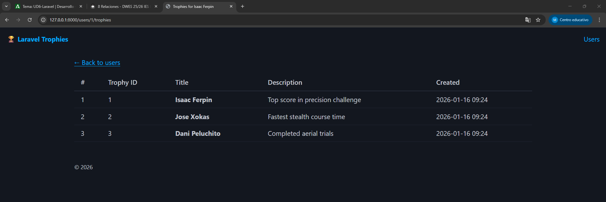
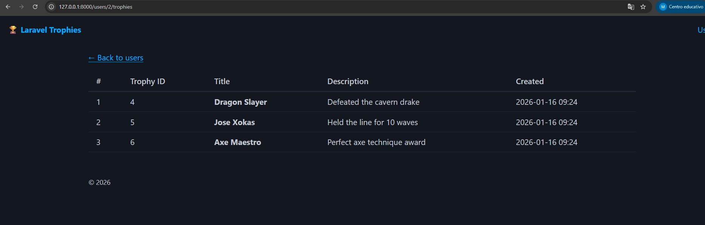

Primero tenemos que crear la carpeta del proyecto

Ahora hacemos las migraciones

Ahora dntro de migraciones seleccionamos la que termine por "create_trophies_table.php" y la modificamos por lo que vemos en la imagen

Nos vamos ahora al arcivo User.php dentro de app/Models

Y a continuacion el Trophy.php

Ahora ejecutamos este comando para crear 3 usuarios en la base de datos

Creamos varios apartados de usuario por eso como podemos ver si en la URL en vez de poner "http://127.0.0.1:8000/users/1/trophies" ponemos
"http://127.0.0.1:8000/users/2/trophies" nos saldran otros usuaios

