Primero tenemos que crear el proyecto

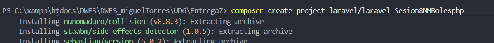

Ahora creamos los modelos de tanto Player como de Role

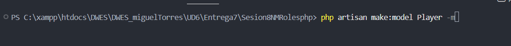

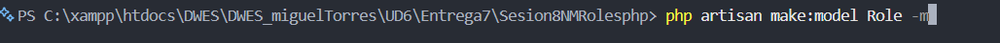

Ahora ceramos la migracion

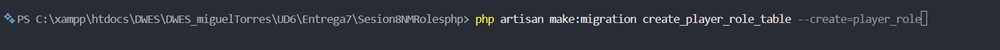

Y con este comando creamos el archivo PlayerController

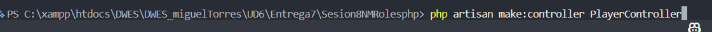

Ahora nos vamos a database y migraciones y modificamos la funcion de "up"

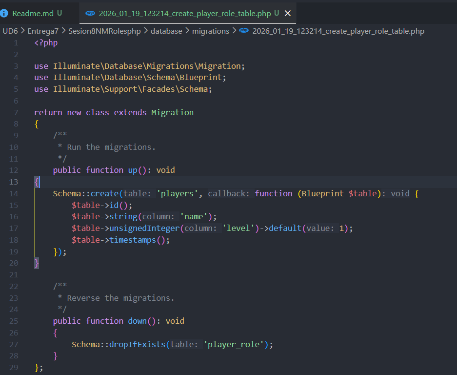

Ahora lo mismo pero en el archivo create_roles

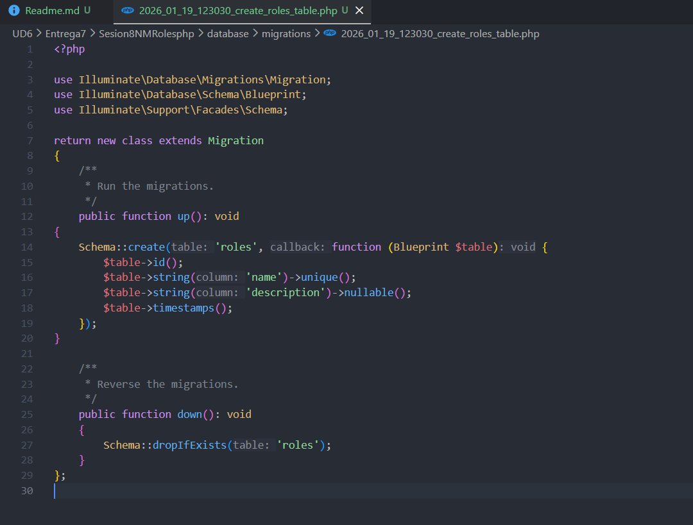

Y ahora en create_player

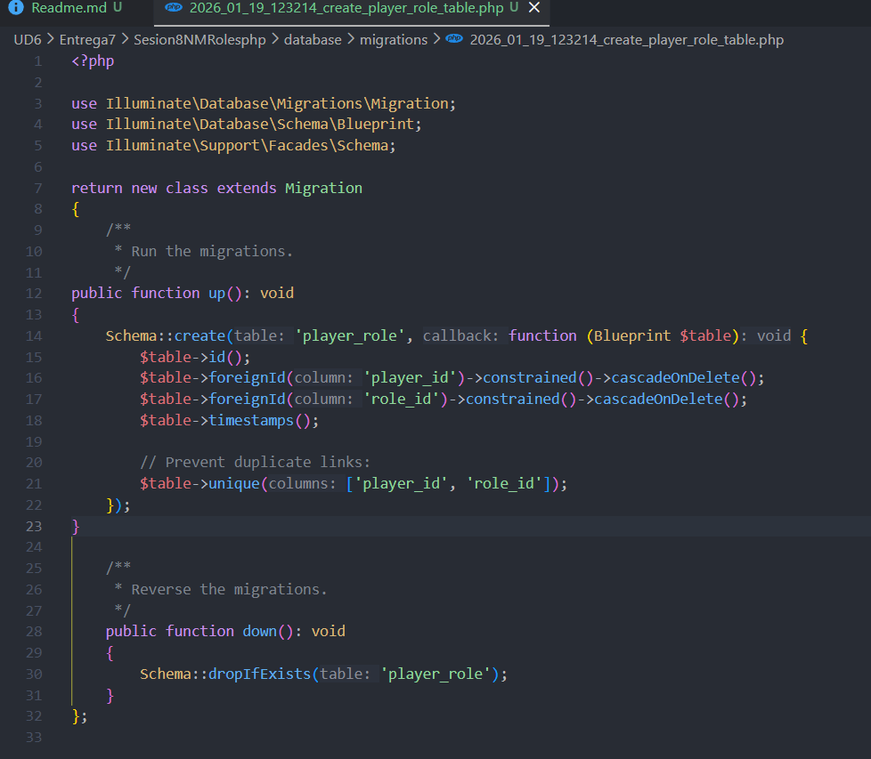

Ahora nos vamos a la carpeta app/Models  y modificamos el archivo Player.php

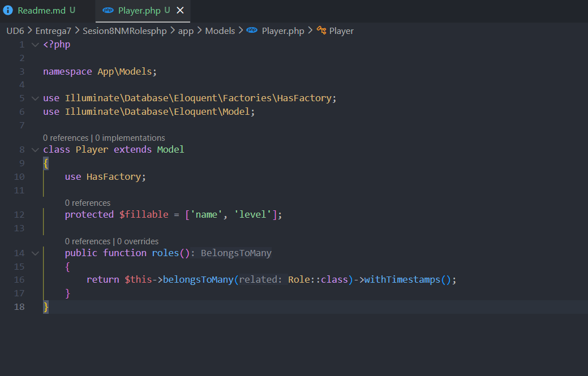

Ahora hacemos lo mimos pero con el archivo Role.php

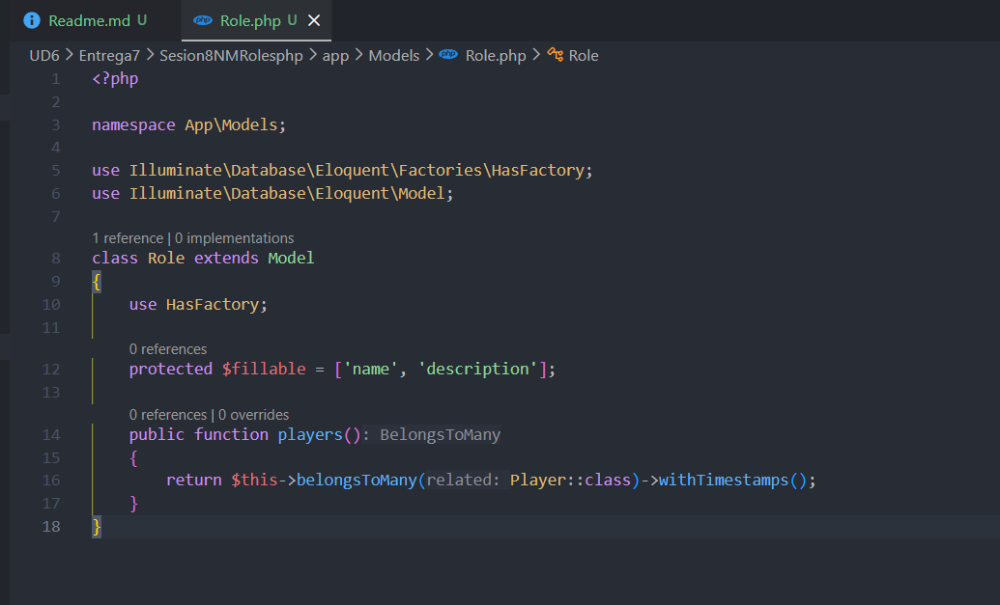

Con estos comandos vinculamos el factory con el modelo

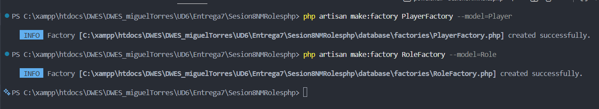

Ahora nos vamos a database/factories y modificamos estos archivos

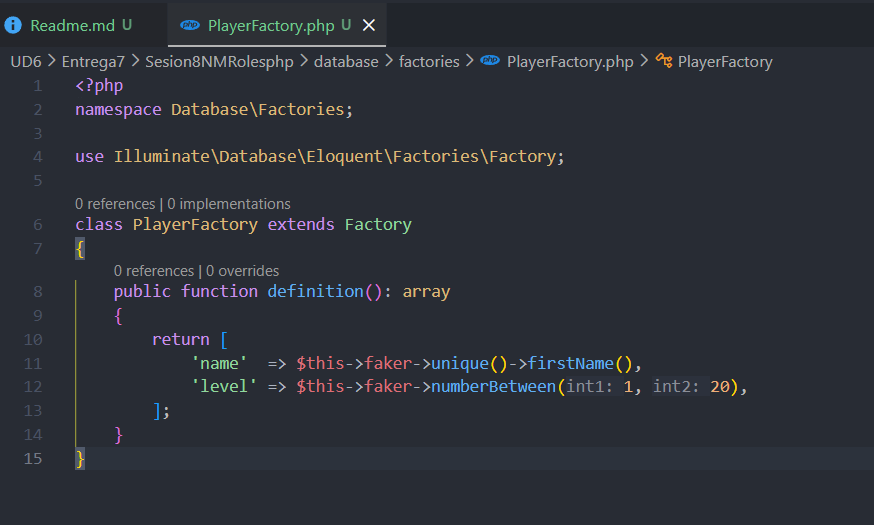

Ahora modificamos RoleFactory

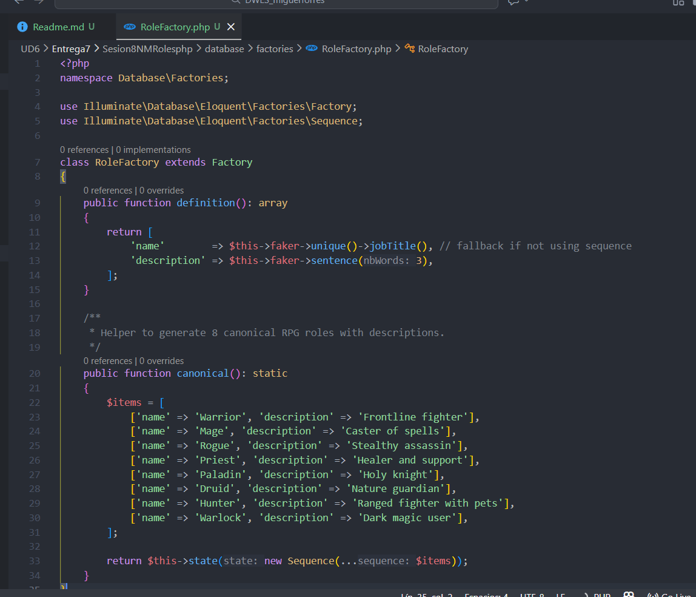

Ahora modificamos el archivo de la carpeta Seeder

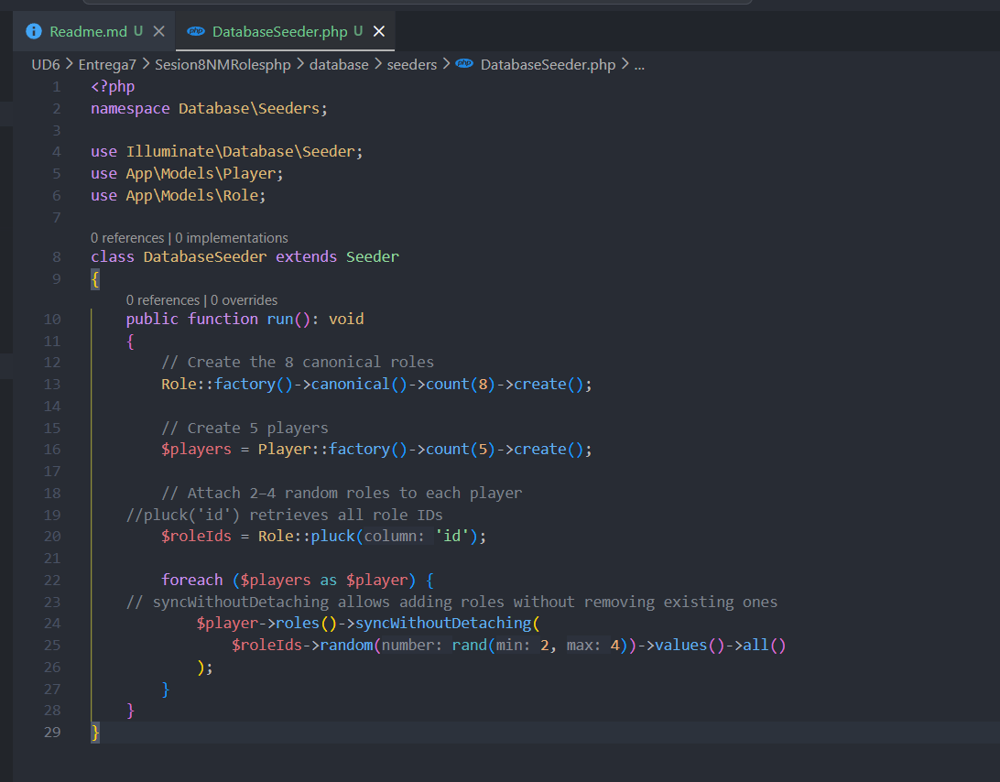

Ahora actualizamos las migraciones

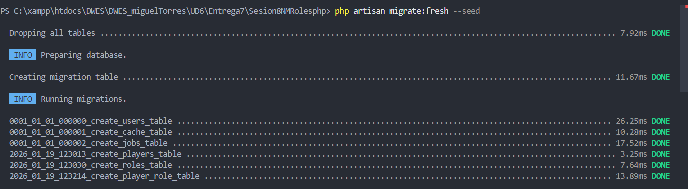

Ahora modificamos el archivo de PlayerController.php

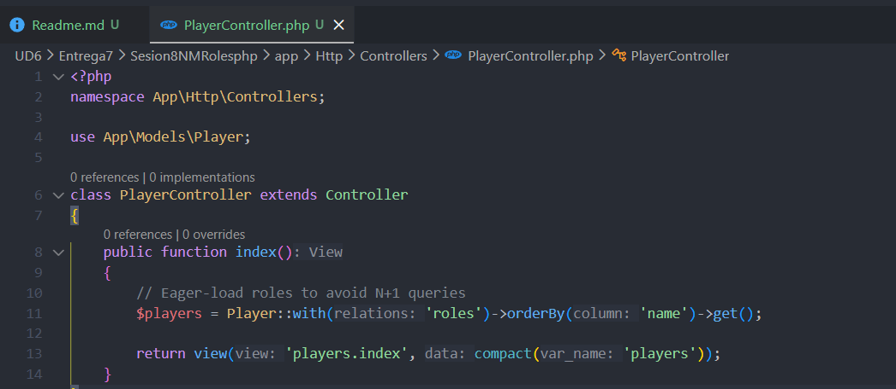

Y en el archivo web.php dentro de la carpeta de route

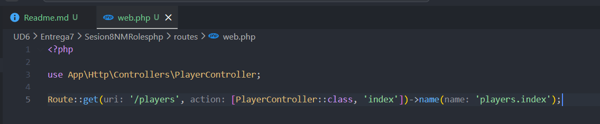

Dentro de la carpeta resources nos vamos a view y dentro a player y modificamos ese archivo

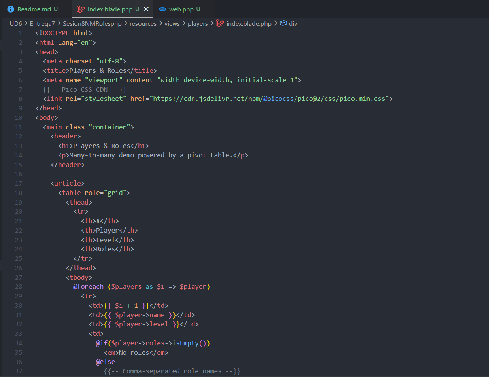

Ahora arrancamos con php artisan serve y en el navegador añadimos /players y esto es lo que nos tiene que mostrar

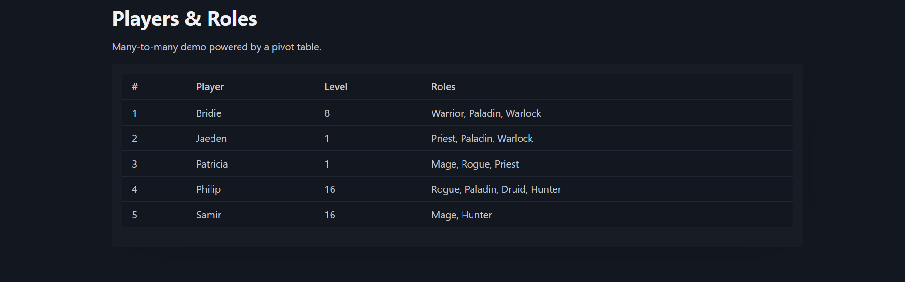
