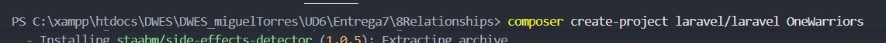

Lo primero que tenemos que hacer es crear el Proyecto

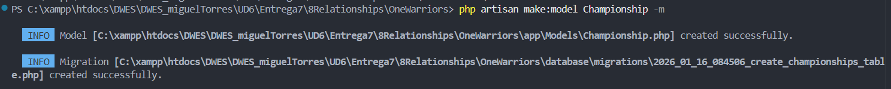

Ahora creamos las migraciones con este comando que vemos en la imagen

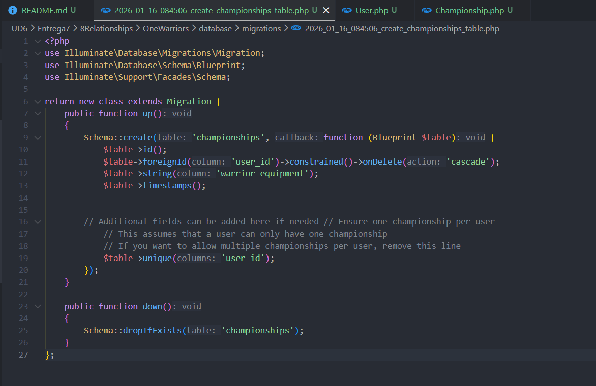

Ahora nos tenemos que ir a la carpeta de "database/migrations" y dentro de la migracion que hemos creado copiamos esto

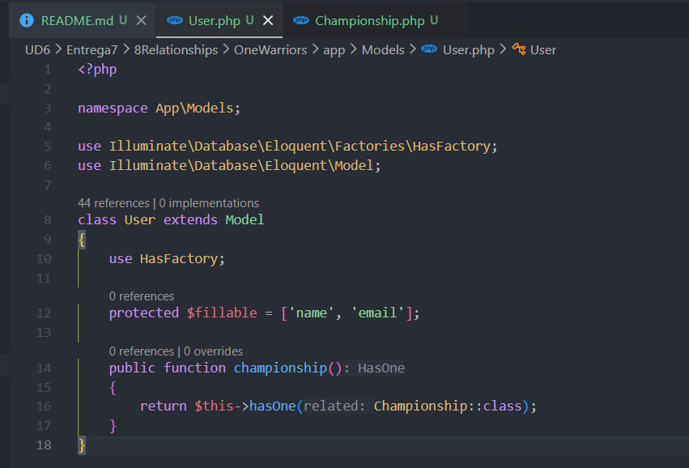

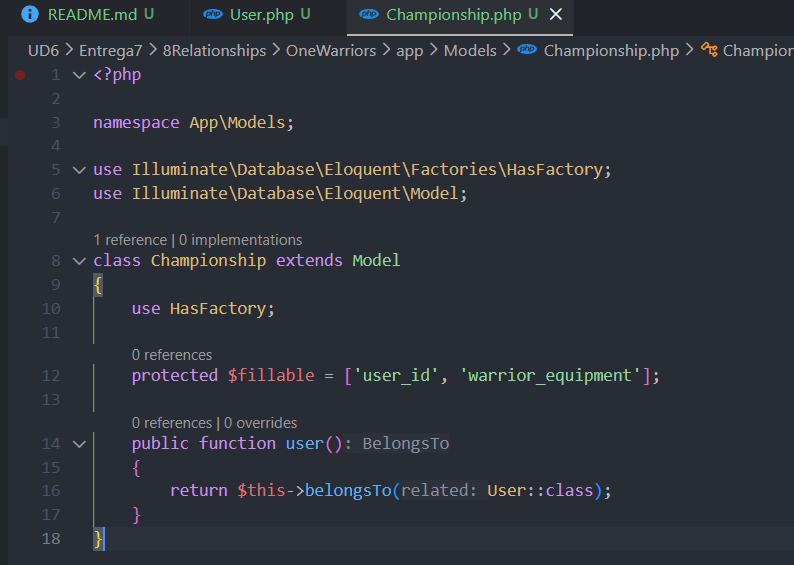

Ahora nos vamos al archivo "Championship.php" y "User.php" que esta en la ruta "app/Models/"

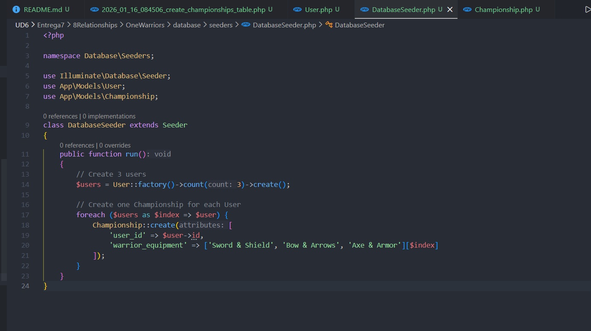

Ahora nos vamos a la carpeta de Seeder y modificamos el archivo y ponemos lo que vemos en la imagen

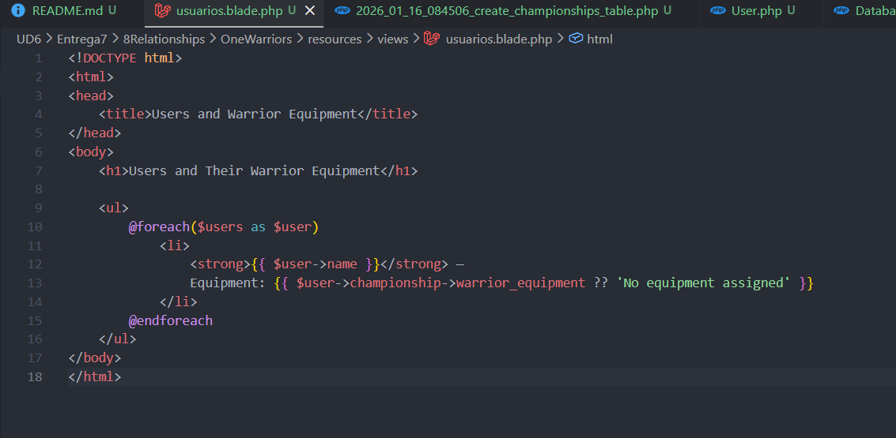

Ahora nos vamos a resources y en el apartado de "view" creamos una vista llamada usuarios.blade.php 

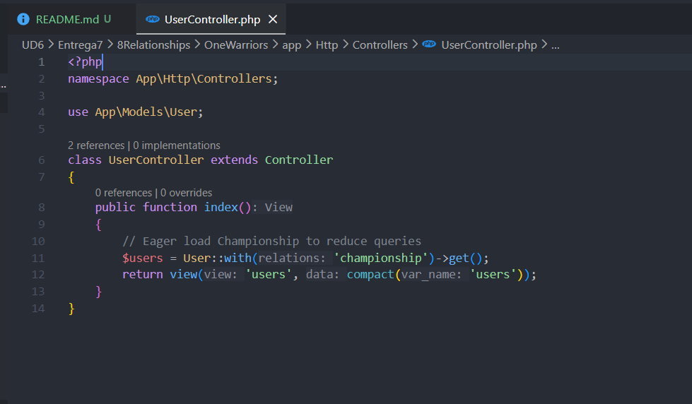

Ahora creamos un UserController.php

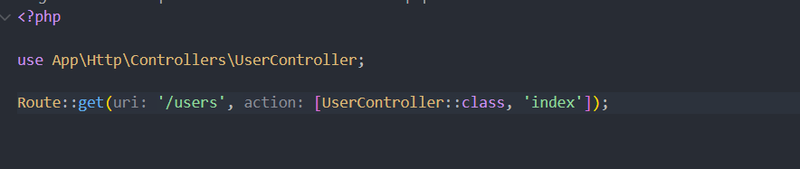

Ahora tenemos que poner el controller en las rutas

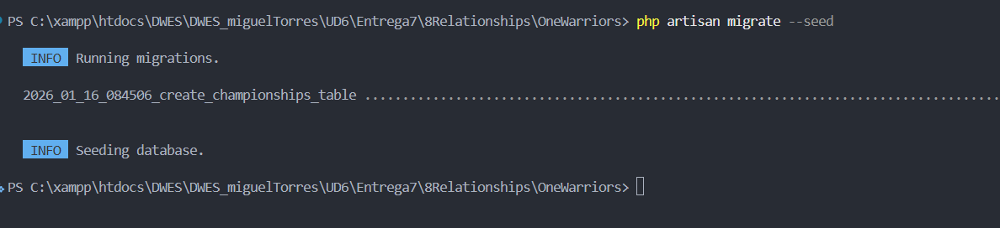

Con este comando lo que logramos es poblar la base de datos

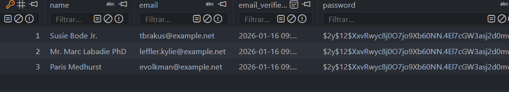

Y como podemos ver se nos ha insertado informacion en el archivo database.sqlite
