# CRUD venues  Reservas

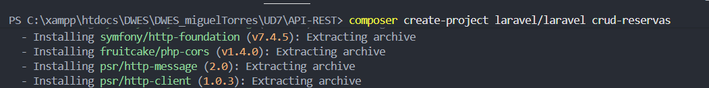

Primero tenemos que crear el proyecto

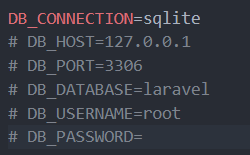

Ahora vemos que la configuracion del archivo .env esta bien 

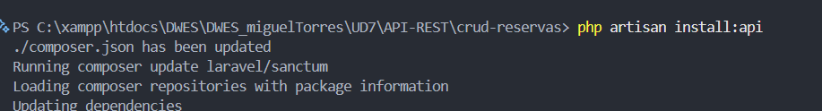

Ahora instalamos la API

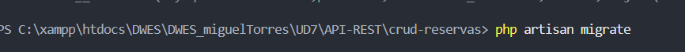

Ahora hacemos las migraciones

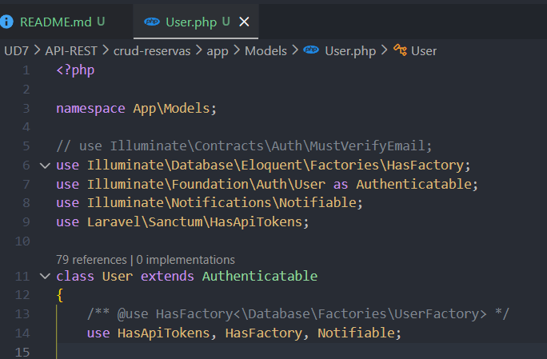

Ahora en la clase User nos aseguramos de tener el "use HasApiTokens"

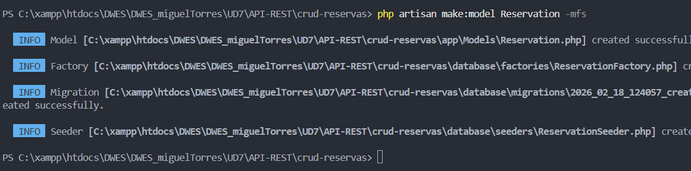

Ahora creamos el modelo reserva con la migracion, el factory y lo seeder incluidos

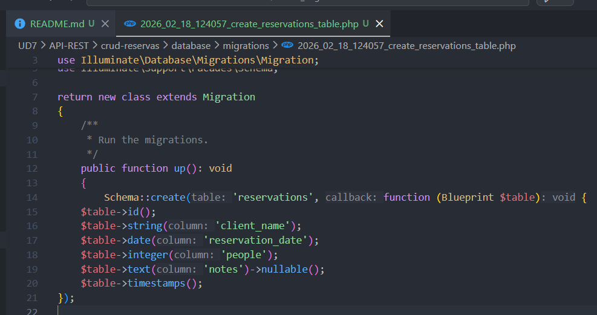

Ahora modificamos los campos de la migracion de create_reservations_table y ejecutamos la migracion

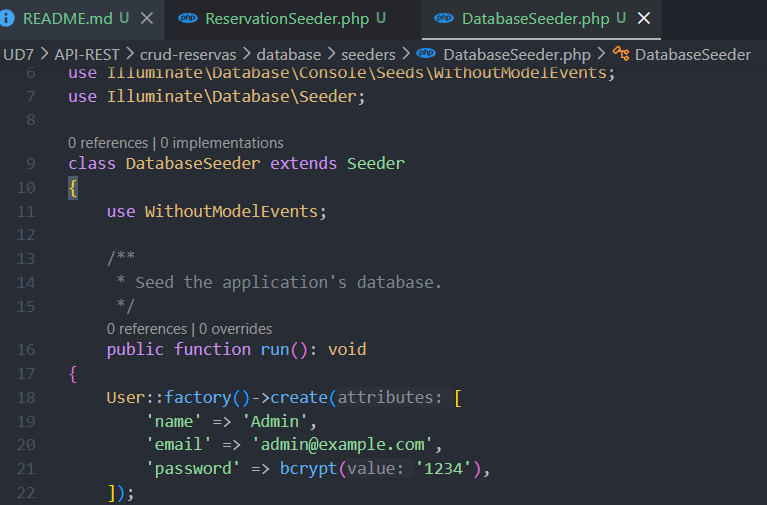

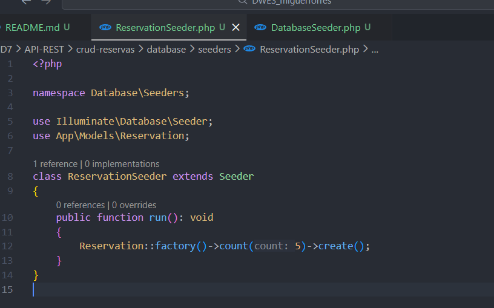

Ahora modificamos las funciones run de los dos archivos que hay dentro de la carpeta seeder

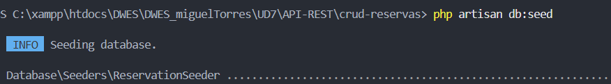

Ahora ejecutamos este comando

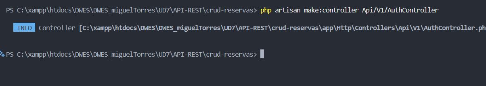

Ahora creamos una Auth API

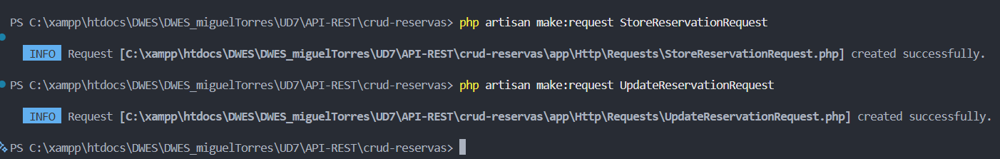

Ahora ejecutamos estos dos comandos

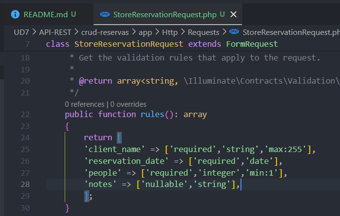

Ahora en el archivo StoreReservationRequiest modificamos el return de la funcion rules

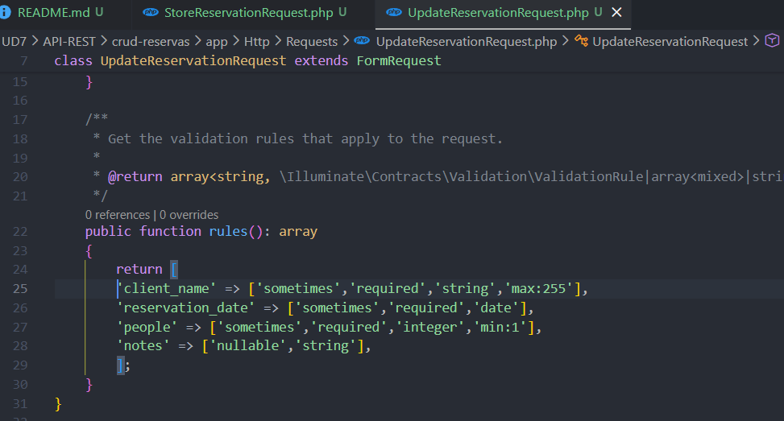

Y hacemos lo mismo en el ruele de UpdateReservationRequest

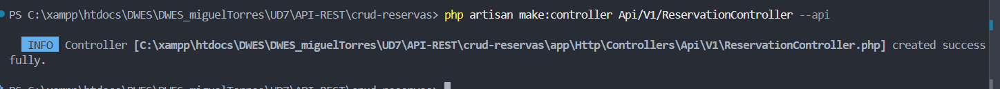

Ahora creamos un controlador CRUD

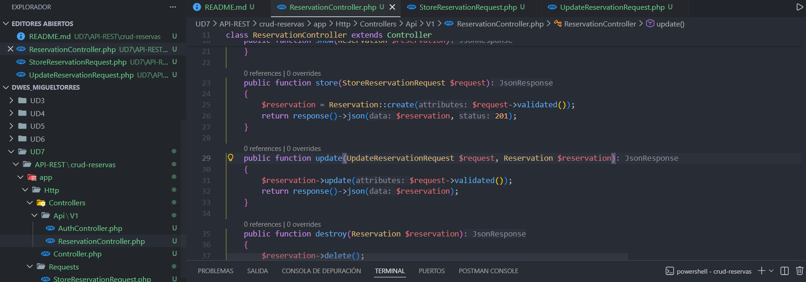

Ahora rellenamos todas las funciones del archivo ReservationController

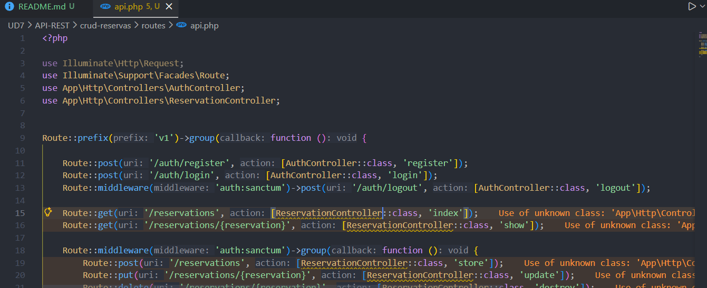

A continuacion rellenamos todas las routas en el api.php

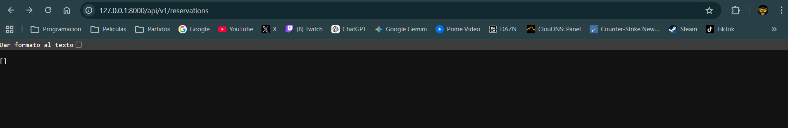

Ya cuando arrancamos el servidor nos mostraria
