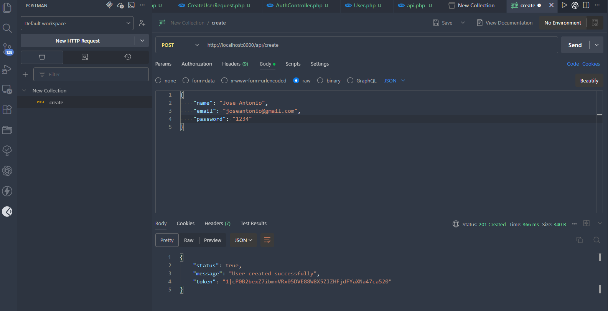
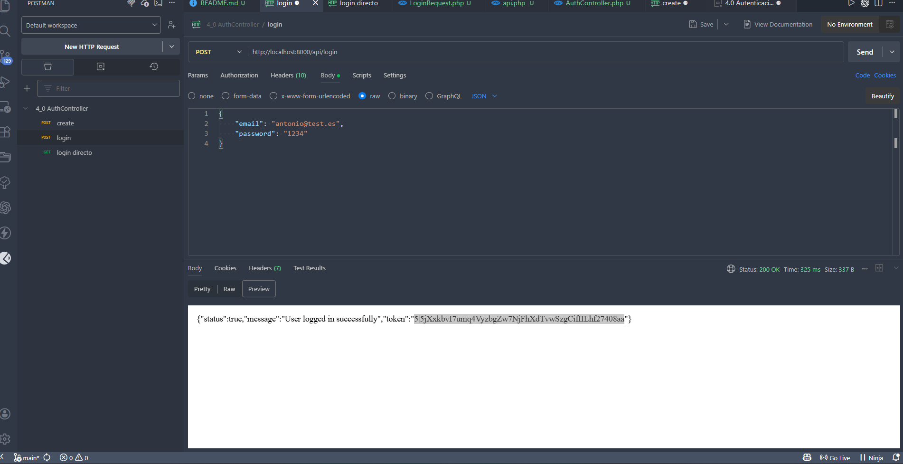

### Primero creamos la API

`php artisan install:ap`

### Creamos los controladores

`php artisan make:controller AuthController`

### Creamos la request

`php artisan make:request CreateUserRequest`

Editamos el authorize y rules.

### Creamos el loginRequest

`php artisan  make:request LoginRequest`

### POSTMAN

Create

Token: "2|kpP1uvTbt2NO5rlFmxA8goRit2YvkoNs0jH3X3hN01595307"

Login

