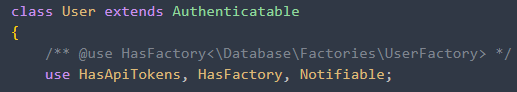
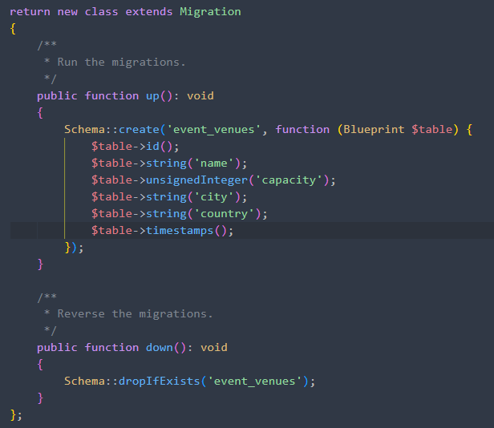
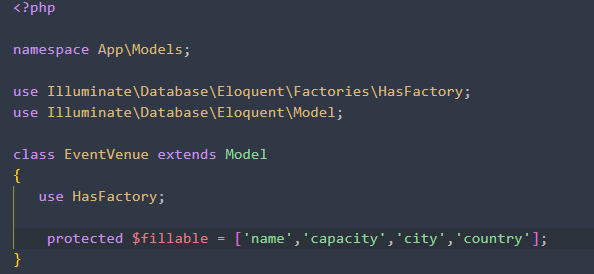
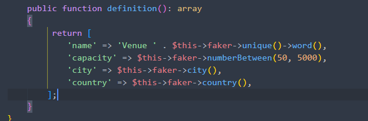
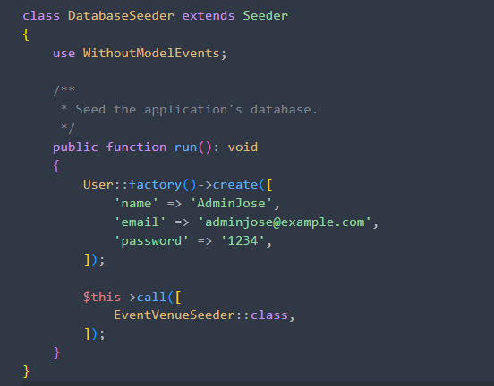
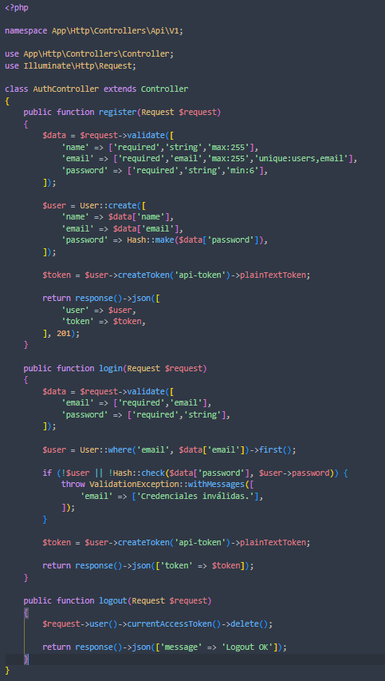
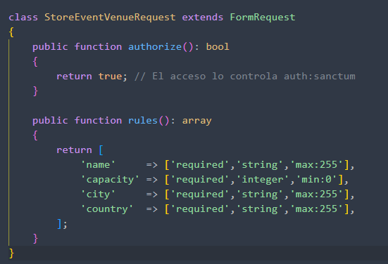
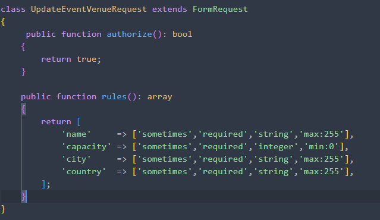
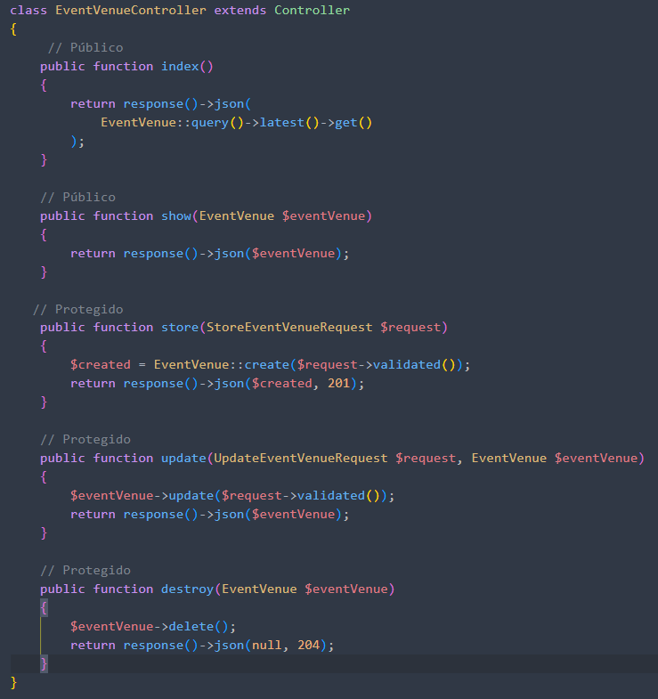
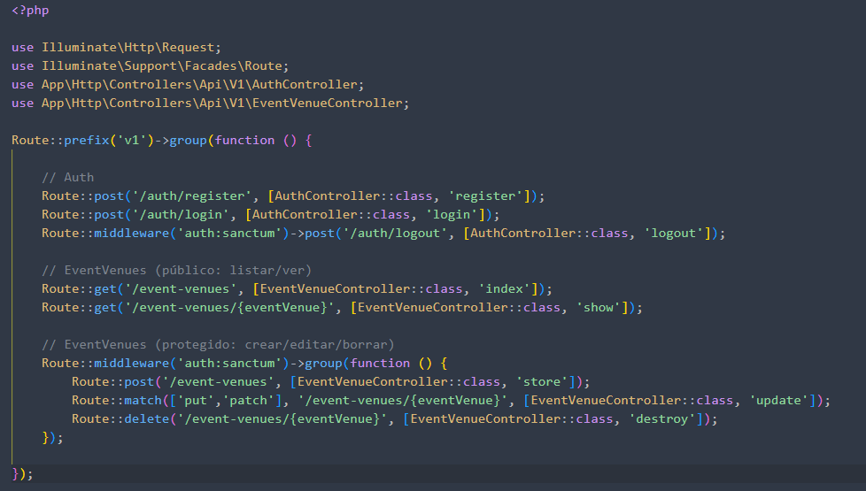

### 1.-Instalmos api:

`phpartisaninstall:api`

### 2-.Añadimos HasApiTokens al modelo

### 3.-Creamos modelo + mmigración + factory + seeder

`phpartisanmake:modelEventVenue-mfs`

### 4.-Editamos la migración, el modelo, el factory, el seeder y el databaseseeder

`Ejecutamos php artisan migrate`

`Ejecutamos php artisan db:seed`

### 5.- Creamos AuthController y lo editamos

`php artisan make:controller Api/V1/AuthController`

### 6.-Creamos Requests y las editamos

`phpartisanmake:requestStoreEventVenueRequest phpartisanmake:requestUpdateEventVenueRequest`

### 7.-Creamos el controlador API y lo editamos

`phpartisanmake:controllerApi/V1/EventVenueController--api`

### 8.-Editamos las routas en routes/api.php

